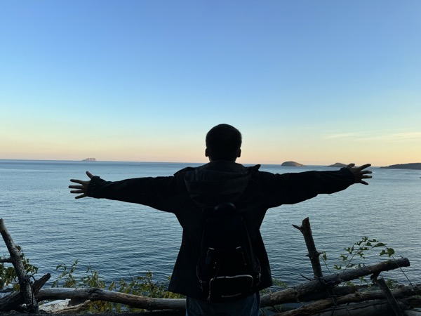

# 关于我

有着8年以上工作经验的**EDA软件工程师**，主力语言C++。

毕业后就一直从事EDA软件开发，界面/前端逻辑优化/后端物理优化都有所涉及。

最近工作内容主要是：
**后端物理优化（Physical Optimization）、性能优化（Performance Optimization）**。

希望尽可能实现工作与生活的平衡（Work-Life Balance），也希望能够有机会不断学习新的知识。

目前在**北京**，如果您对[我的简历](resume)感兴趣，
可以通过邮箱[dubinstudent@126.com](mailto:dubinstudent@126.com)联系我。

---

来自东北小县城，但妹有很重的东北口音。

国行Switch烈士，偏爱复古像素风游戏，玩不来多数大作因为晕3D。

上学的的时候喜欢唱、~~跳、RAP~~、篮球🏀，然而工作之后打球的次数越来越少。

喜欢看各种闲书，1100+小时微信读书📖记录，尤其钟爱武侠、推理。

对动漫了解有限算个半宅；
生活已经挺苦了，因此偏好[日常](https://movie.douban.com/subject/4848701/)搞笑向作品。

前些年假期宅家的时候多，后来在同学和女朋友的带领下也去过一些地方旅行。

想发展的爱好有很多，吉他🎸/尤克里里/电子琴🎹/围棋/画画✍️等等，但总是学不会。

希望生活能简单快乐，不要总是苦中作乐；愿望是早日退休，~~财富自由~~。

---
> last update time: 2025/07/01

## 最近更新

- 提升自己的C++水平；
- 学习STA相关知识；
- ... ...

