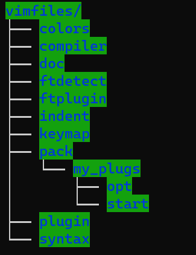

# Vim常见使用技巧

本文将记录一些常见的Vim使用技巧，基本上都是在工作中使用到的。（[Vim Cheat Sheet](https://vim.rtorr.com/lang/zh_cn/)）

## 查找/删除/替换等

### 查找高亮/取消高亮
查找字符串比较简单，在命令行模式下输入斜杠`/`，后面接需要查找的模式即可；

为了不匹配到其他字符串中的字串，例如查找`bc`但不希望匹配到`abcd`，可以通过转义后的尖括号加以限制`/\<bc\>`。

快捷键：通过`Shift` + `*`对光标当前位置的字符串快速选中并查找下一个位置。

如果要取消高亮，需要通过命令实现。完整命令为`:nohlsearch`，或者使用缩写`:noh`。

### 显示匹配模式的数目
命令很简单，可以加入正则表达式进行灵活匹配：
```shell
:%s/pattern//gn
```
只用`g`可以实现替换，`gn`就仅显示数目。

### 删除行尾的^M
Windows/Dos下的换行符为`\r\n`，而Linux/Unix下的换行符为`\n`。

导致Windows下产生、编辑过的文本，在Linux下打开时换行的位置会多一个`\r`字符，被显示^M。通过命令删除（替换为空）：
```shell
:%s/\r//g
```

### 对每行只保留特定模式而删除其他内容
```shell
:%s/^.*\(pattern\).*$/\1/g
```
本质上是Vim中字符串的替换，这里用到了正则表达式中的反向引用"\1"，即引用匹配中第一个组（第一个小括号内）的内容。注意在Vim的命令行中小括号并不是特殊字符，需要加转义字符'\'才有分组功能。

### 删除包含特定字符串的行，并在删除前提示
```shell
:%s/^.*pattern.*$//c
```
本质上还是替换，用空字符替换一整行。删除行还有其他的方法。

### 删除特定行
删除包含特定模式的行：
```shell
:g/pattern/d
```
例如删除空行：`:g/^$/d`。

删除不包含特定模式的行
```shell
:v/pattern/d
```

### 删除命令实例
- 处理字符串`/123/456/789/109/example.txt`，怎么删除到最后一个`/`，然后得到`example.txt`？

**答：** `0dte`。其中，`0`：移动到行首，`dte`：删除到第一个字母`e`的位置。

- 处理字符串`/123/456/789/ef/109/example.txt`，怎么删除到最后一个`/`，然后得到`example.txt`？

**答：** `$T/d0`。其中，`$`：移动至行尾，`T/`：从后向前搜索到第一个`/`字符的位置，`d0`：删除到行首。或者`d/ex`，删除到第一个`ex`出现的位置。

## 添加信息
### 添加和删除多行注释
可以通过Vim的可视模式进行实现。在命令模式下，按键`v`、`Ctrl` + `v`和`Shift` + `v`会进入不同的可视模式：
- `v`：常规的可视模式，单个字符选择模式
- `Ctrl` + `v`：块选择模式，可选择块状区域进行操作
- `Shift` + `v`：行选择模式，以行为单位进行选择

对于C/C++的多行注释，即`//`来说，就可以通过块选择模式来进行添加或删除。

### 添加作者相关信息
添加对按键`F4`的映射，并预置一段代码（简单举例）：
```shell
map <F4> ms:call AddSimpleTitle()<CR>
function AddSimpleTitle()
  let n = line('.')
  call append(n + 0, "# *****")
  call append(n + 1, "")
  call append(n + 2, "# * Create time  : ".strftime("%Y-%m-%d %H:%M"))
  call append(n + 3, "# * File name    : ".expand("%:t"))
  call append(n + 4, "")
  call append(n + 5, "# *****")
endfunction 
```

## 光标移动相关
> [Vim光标快速移动技巧总结](https://blog.csdn.net/llzhang_fly/article/details/80474966)
> waiting for writing ...

## 其他
### 跳转命令
在源文件中如果指定了头文件，比如`#include "utility/utility.h"`这种形式，可以通过快捷键组合`g` + `f`实现快速跳转到utility/utility.h文件中。

### 插件ctags的使用
在已经安装ctags的前提下，在源文件目录下，直接执行（对于C++）生成tags文件：
```shell
ctags -R --c++-kinds=+px --fields=+iaS --extra=+q
```
这几个选项的大致含义如下：
- `c++-kinds`用于指定C++语言的tags记录类型，通用格式：`--{language}-kinds`；
- `--fields`用于指定每条标记的扩展字段域；
- `--extra`用于增加额外的条目，参数`q`为每个类增加一个条目，参数`f`为每个文件增加一个条目。

在Vim中指定目标路径下使用tags文件：
```shell
:set tags=./tags
```
在代码更改后只需执行`ctags -R`即可将tags进行同步更新。在Vim中使用tags的信息：
- 查找函数或变量的定义位置快捷键`Ctrl` + `]`，或使用命令`:ta name`
- 从函数或变量定义的位置跳转回查找的位置`Ctrl` + `t`
- 向前跳转/向后跳转：`Ctrl` + `i` / `Ctrl` + `o` <font color = blue>这个命令和ctags无关</font>

初步配置完成之后，通常`Ctrl` + `]`会默认跳转到找到的第一处定义的文件中，如果需要先列出所有同名定义的位置，需要组合键`g` + `Ctrl` + `]`。可以通过按键映射的方式修改：
```shell
map <c-]> g<c-]>
```
### Git Gutter插件相关
配置Git Gutter插件之后，可以直接高亮本地的改动：
```shell
set g:gitgutter_enable=1
let g:gitgutter_highlight_lines=1
"let g:gitgutter_sign_added='A' 没必要改，默认的'+'感觉也行
...
nnoremap <silent> <leader>d :GitGutterToggle<cr>
```
通过直接在命令模式下输入`:GitGutterToggle`，可以直接控制Git Gutter插件启用或关闭；
- `gitgutter_enable`表示初始插件是否启用；
- `highlight_lines`会背景高亮有改动的代码；
- `sign_added`表示新添加的代码前会有`A`表示，此外可以修改`sign_modified`、`sign_removed`等不同类型改动代码前的表示。

### 设置快捷键进行编译
通过按键映射，可以指定某个按键来启动编译。如下：
```shell
noremap <F5> : call CompileProject()<CR>
function! CompileProject()
  if filereadable('configure')
    execute "!./configure 30"
  endif
endfunction
```
其中，execute运行可执行文件，`filereadable()`用于判断文件是否存在。

### 自带的文件浏览器netrw
如果可以装插件的话，可以使用nerdtree；没有联网条件使用vim自带的netrw也勉强可以。配置也很简单：
```shell
"设置目录列表的样式：树型
let g:netrw_liststyle=3
"水平分割时，文件浏览器始终显示在左边
let g:netrw_altv=1
"设置文件浏览器窗口宽度为25%
let g:netrw_winsize=20
```
最后一项设置，以当前文档打开的窗口为基准。如果已经水平分割，那么是在50%的基础上进行25%。

### vim打开文件并定位到某一行
只需要在文件名的末尾，加上` +line_num`即可。即：
```bash
vim 文件名 +行号
vim test.cpp +12
```

### 修改vim中的光标样式
在gvim里，不同的模式下（如插入模式、替换模式、选择模式）光标的样式是不同的，但linux原生的vim默认都是一样的。

为了方便区分，还是要进行一些设置，这里以公司的环境KDE桌面、konsole终端为例：（其他环境的配置见参考文章）
```bash
let &t_SI = "\<Esc>]50;CursorShape=1\x7"
let &t_SR = "\<Esc>]50;CursorShape=2\x7"
let &t_EI = "\<Esc>]50;CursorShape=0\x7"
```
以上的参数含义：
- EI: INSERT mode
- SR: REPLACE mode
- EI: NORMAL mode (ELSE)

光标类型有以下几种：
- 1 -> blinking block
- 2 -> solid block
- 3 -> blinking underscore
- 4 -> solid underscore
- 5 -> blinking vertical bar
- 6 -> solid vertical bar

### 使用vim8原生方式安装插件
我个人不怎么推荐安装插件，因为这样跨平台要处理的东西会很多；而且会拖慢vim的速度。当然不否认很多插件确实比较优秀，比如airline。

如果有vim8的话，推荐用原生的方式安装。使用Vundle或Plug来管理插件虽然也比较方便，但原生的方式只需要创建几个文件夹即可。

以Windows平台为例：

首先在用户目录下的`vimfiles`文件夹中，新建一个目录`pack`，然后根据需要在`pack`目录下新建文件夹，名称任意，例如`my_plugs`。在该目录下，再创建子目录`start`和`opt`，这样目录结构就创建好了，例如下图：



目录建好之后，就可以将插件克隆到`start`或`opt`中使用了，克隆到`start`目录中的插件会再vim启动时自动加载；而克隆到`opt`目录下的插件不会自动加载，需要再vim命令模式中使用命令`packadd plugin_name`进行加载。

### 使用vim-plug安装插件

感觉更加懒得折腾了，插件还是用轻量级的，在有网络的前提下使用vim-plug安装插件还是比较方便的。
vim-plug安装方法如下：

1. 离线安装
```bash
mkdir -p  ~/.vim/autoload/
cp plug.vim  ~/.vim/autoload/plug.vim
```
2. 在线安装
```bash
curl -fLo ~/.vim/autoload/plug.vim --create-dirs https://raw.githubusercontent.com/junegunn/vim-plug/master/plug.vim
```

安装完成后只需要修改`~/.vimrc`文件，添加插件即可。我目前会添加的几个插件如下：
```bash
call plug#begin()
Plug 'skywind3000/vim-auto-popmenu'
Plug 'skywind3000/vim-dict'
Plug 'jiangmiao/auto-pairs'
Plug 'preservim/nerdtree'
call plug#end()
```
其中，`vim-auto-popmenu`这个插件还会增加一些设置，用于自动补全。
```bash
" enable this plugin for filetypes, '*' for all files.
let g:apc_enable_ft = {'text':1, 'markdown':1, 'php':1}
" source for dictionary, current or other loaded buffers, see ':help cpt'
set cpt=.,k,w,b
" don't select the first item.
set completeopt=menu,menuone,noselect
" suppress annoy messages.
set shortmess+=c
```
修改完成后重新`source ~/.vimrc`，然后打开任意文本文件执行`PlugInstall`即可。
其他Plug相关命令可以利用补全自己查看。
- `PlugInstall`：安装插件
- `PlugClean`：卸载插件
- `PlugUpgrade`：升级vim-plug自身
- `PlugUpdate`：升级插件
- `PlugStatus`：查看插件状态

### 在vim中查看当前文件的完整路径
先按数字`1`，然后按组合键`Ctrl`+`G`，即可显示当前文件的完整路径（实际上是相对于Vim当前工作路径的相对路径，但足够用了）。

如果第一个按键是大于1的，那么对应的buffer名称也会被显示。（不太理解buffer在vim里的用法）

也可以在状态栏显示完整路径，但不怎么需要：
```bash
set statusline+=%F
```
PS：如果是在VimScript中，或者在Command Line中，符号`%`的含义就是当前文件，例如用`:grep "pattern" %`就能抓取当前文件中的指定规则的行。

### Vim2021：超轻量级代码补全系统
具体内容见参考文章14。体验下来效果还不错，文件也不大，甚至可以直接拷贝到vimrc中。但一定要在vim8之后的版本。

vim8之前的版本，在弹出补全菜单的设置项里，没有`noselect`这个选项，导致会默认选择弹出菜单的第一项，给回退造成很大的困扰，使用体验极差。

配置完成后默认是不开启的，需要在命令行中显式开启`ApcEnable`即可使用；关闭时使用`ApcDisable`。

### 在vimdiff中移动光标/展开/折叠其他部分
两种启动vimdiff的方法：
```
vimdiff File1 File2
vim -d File1 File2
```
跳转（只需要把中括号看作箭头就不会记错方向）：
- 跳转到下一个差异点：`]c`；
- 跳转到上一个差异点：`[c`。

展开与折叠（之所以用`z`这个字母，因为它看起来很像是折叠起来的纸）
- 展开（folding open）：`zo`；
- 折叠（folding close）：`zc`。

重新计算差异:
```bash
:diffupdate
```
在进行多次更改后vim不再显示最小更改时很有用。如果全部重新加载，使用`:e`即可。

其他关于`vimdiff`的功能展开，可以参考文章18。

### 选中部分文字后直接搜索
详见参考文章17，英文社区的回答。
- 按`v`进入选择模式，选择需要搜索的文字；
- 按`y`将选择的文字复制到Vim的寄存器中（默认为`"`寄存器）；
- 按`/`进入搜索模式（这里也可以换成`?`，选中的文字就不需要补充转义符）；
- 按组合键：`Ctrl`+`r` `"`，将选中的文字从寄存器中复制出来；
- 按回车开始搜索。

### 让内置终端进入只读模式
在Vim8之后增加了内置终端，通过`:terminal`或者简写`:term`或`:ter`即可打开一个内置终端的窗口，可以和正常的分割窗口一样切换。

内置终端支持切换模式（默认为insert模式），可进入只读状态（normal模式），让终端里的内容像打开的文本文件一样查看。
这样在Vim内置终端运行的结果，可以不用特意重定向到文件，就能直接查看。
- 在默认insert模式下，先按`Ctrl+\`再按`Ctrl+n`进入normal模式
- 在normal模式下，按`i`或`a`等这种插入快捷键回到insert模式

组合键还是太复杂，可以进行按键映射。`tmap`代表只在内置终端中进行映射，其他的编辑窗口中不受到影响。
```vimscript
tmap <c-v> <c-\><c-n>
```
如果有其他的Vim内置终端设置需要，可参考文章19。其他一些不同的键盘映射命令见参考文章20。

### 将某个窗口直接放到最底下
通常分屏会在当前窗口中进行分割，这就导致了窗口越分越小。
有时候希望某个窗口放到整个屏幕的最下，且长度和屏幕一样宽。类似于visual studio那种终端窗口、显示warnings/errors的窗口等。

放到整个屏幕最下的快捷键为`Ctrl+w`然后按`J`，注意是大写字母，一般需要加`Shift`。见参考文章21，完整的上下左右调整快捷键：
- 最左侧：`Ctrl+w`再按`H`
- 最上侧：`Ctrl+w`再按`K`
- 最右侧：`Ctrl+w`再按`L`
- 最下侧：`Ctrl+w`再按`J`

即：`HJKL`对应左下上右。

## 参考文章
1. [Vim的匹配删除](https://blog.csdn.net/yrx0619/article/details/81032610)
2. [Vim替换反向引用，模式匹配回溯引用...](https://www.qinziheng.com/vim/5651.htm)
3. [Vim删除行尾的^M](https://www.cnblogs.com/wangkongming/p/4624524.html)
4. [Vim的高亮搜索](http://www.voidcn.com/article/p-hrozitlh-zm.html)
5. [Vim中自动添加注释 添加文本信息](https://blog.csdn.net/yusiguyuan/article/details/41090709)
6. [Vim插件ctags的安装与使用](https://www.cnblogs.com/zl-graduate/p/5777711.html)
7. [ctags跳转错误](https://segmentfault.com/q/1010000003734392)
8. [Vimscript判断文件是否存在](https://wxnacy.com/2019/02/21/vimscript-file-exists/)
9. [玩转Vim自带的文件浏览器netrw](https://cloud.tencent.com/developer/article/1891433)
10. [vim 打开文件并定位到某一行](https://blog.csdn.net/xiaobinqt/article/details/95107898)
11. [Change cursor shape in different modes](https://vim.fandom.com/wiki/Change_cursor_shape_in_different_modes)
12. [Windows gvim安装插件](https://blog.csdn.net/weixin_42250302/article/details/108019214)
13. [How can I see the full path of current file](https://vi.stackexchange.com/questions/104/how-can-i-see-the-full-path-of-the-current-file)
14. [Vim2021：超轻量级代码补全系统](https://zhuanlan.zhihu.com/p/349271041)
15. [关于linux：如何在Vimdiff中展开/折叠其他部分](https://www.codenong.com/5288875/)
16. [vim-plug插件安装及使用](https://www.cnblogs.com/zhaodehua/articles/15108744.html)
17. [How to search for selected text in Vim?](https://superuser.com/questions/41378/how-to-search-for-selected-text-in-vim)
18. [技巧：Vimdiff 使用](https://www.cnblogs.com/motoyang/p/6091281.html)
19. [Vim内置终端调教记](https://zhuanlan.zhihu.com/p/102287909)
20. [vim的几种模式mode和按键映射map](https://www.cnblogs.com/sunsky303/p/13522437.html)
21. [How to open a vertical split to the main view not just next to the current one in case of horizontal splitted viewport?](https://vi.stackexchange.com/questions/14141/how-to-open-a-vertical-split-to-the-main-view-not-just-next-to-the-current-one-i)


