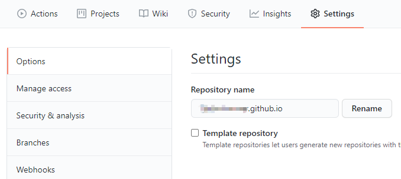
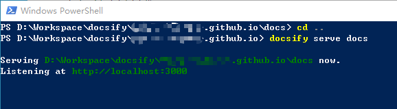
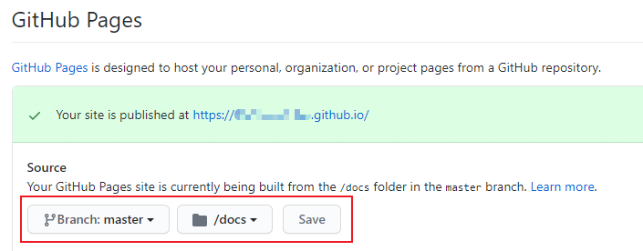

# 博客搭建

## 前言

这应该是第三次在Github Pages上搭建博客，前两次分别用的`jekyll`和`hexo+Next`。从复杂度上来说，`jekyll` < `hexo+Next`，但同步起来都不方便，一旦换电脑就很麻烦。这次偶然从知乎上看到的`docsify`的方案，试了一下的确很方便，显示效果也符合我的要求，一点也不花里胡哨。

下面将简单记录一下搭建的过程及中间遇到的问题，主要参考[这一篇文章](https://www.cnblogs.com/happyone/p/12152566.html)。话说这次操作方便了，能养成记录博客的习惯吗？/(ㄒoㄒ)/~~

首先说明，这次是在Win10上进行的操作。

## Github上的准备

新建仓库，直接在Github网页端完成。如果想直接通过`https://username.github.io`访问的话，新仓库要命名为`username.github.io`。当然，创建后名称也可以改，问题不大。



## 连接git和Github

到`git`的[官网](https://git-scm.com/download/win)下载对应的版本并安装。

连接git到Github，网上教程很多，不在此详述。[这一个教程](https://www.cnblogs.com/flora5/p/7152556.html)，核心操作：生成ssh的key，在Github的settings中读入。

选择一个工作目录，直接通过`clone`的方式，将之前新建的仓库同步到本地：

```bash
git clone https://github.com/username/username.github.io
```

## 安装docsify

应该需要`node.js`的环境，直接去[官网](http://nodejs.cn/download/)下载安装对应的版本。

然后安装`docsify`，在Win10的Terminal/PowerShell中执行：

``` bash
npm i docsify-cli -g
```

## 初始化docsify到仓库中

在`clone`下的仓库目录中，执行`docsify`的初始化：

``` bash
docsify init ./docs
```

这里可能会遇到**此系统上禁止运行脚本**的问题，这是PowerShell执行策略默认设置为`Restricted`的原因，需要使用**管理员权限**修改。详细内容可以[参考这里](https://www.jianshu.com/p/4eaad2163567)，在PowerShell中执行：

``` bash
set-executionpolicy remotesigned
```

执行`docsify init ./docs`之后，将生成`docs`文件夹，内部包含几个文件：
- .nojekyll    用于阻止Github Pages忽略掉下划线开头的文件
- index.html   文件入口，可以修改其中的配置进行定制
- README.md    默认的主页

以下划线开头的文件多是`docsify`的配置文件，如侧边栏`_sidebar.md`，后续进行定制时可以进行添加。

通过启动服务来进行预览：

``` bash
docsify serve docs
```



访问对应的链接`http://localhost:3000`，即可看到预览效果。

暂时不配置其他内容，将这些文件`push`到Github的仓库中：

``` bash
git add -A
git commit -m "myblogs first commit"
git push -u origin master
```

## 配置Github Pages

成功提交到Github仓库之后，进行Github Pages的配置：



直接访问`https://username.github.io`即可，和预览的效果一致。

如果需要定制相应的功能的话，直接去参照`docsify`的[官方文档](https://docsify.js.org/)进行功能添加、修改即可。有中文版，很方便。

PS：总体来说图片码了个寂寞😂


## 参考文章
1. [Git基础-获取Git仓库](https://www.git-scm.com/book/zh/v2/Git-基础-获取-Git-仓库#ch02-git-basics-chapter)
2. [Git与Github的连接和使用](https://www.cnblogs.com/flora5/p/7152556.html)
3. [PowerShell因为在此系统上禁止运行脚本解决方法](https://www.jianshu.com/p/4eaad2163567)
4. [基于Github Pages + docsify半天搭建个人博客](https://www.cnblogs.com/happyone/p/12152566.html)
