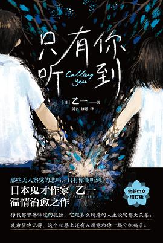
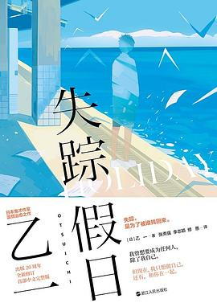
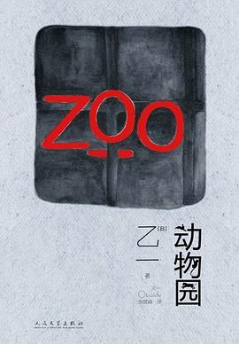

# 我的书单

重拾读书的习惯。要多读书，读好书。

## 专业技能类

- 编码
- Effective C++
- 深入理解计算机系统（CSAPP）

### 公众号推荐
#### LeetCode（[原文](https://mp.weixin.qq.com/s/yE6MC1H1H9l5V8wI-gnkJA)）：
- 算法竞赛进阶指南：建议读完 算法竞赛入门经典-刘汝佳 之后再阅读
- Python神经网络编程、深度学习入门：应该是入门书籍，有空闲就可以读
- 汇编语言-王爽：知道这本书很久了，有电子版，还没开始读😓
- 数据结构（C++版）- 邓俊辉：据说还有配套电子书
- 计算机程序的构造和解释（SICP）：好像已经买了这本书，还是没开始读😓

原文中还推荐了基本和网络相关的书，因为基本工作中不涉及，所以暂不列出；和设计模式相关的也暂时忽略。

#### 编程技术宇宙（[原文](https://mp.weixin.qq.com/s/5yQ1Or1LDyn0stnowAK0iw)）
编程相关：
- STL源码剖析
- C++ Primer
- 深度探索C++对象模型
- Boost程序库完全开发指南
- 大话数据结构
- 深入理解Windows操作系统·第六版
- 软件调试

网络安全相关
- Python黑客攻防技术入门
- 漏洞战争：软件漏洞分析精要
- Android软件安全与逆向分析
- 天书夜读-从汇编语言到Windows内核编程
- Metasploit渗透测试指南
- C++反汇编与逆向分析技术揭秘
- 白帽子讲浏览器安全
- Windows PE权威指南

#### C语言与CPP编程
- [聊聊我是如何入门编程的](https://mp.weixin.qq.com/s/3vMi2-r8I6Cy3TOs3kDRVA)
- [C++的最后一道坎（历史与推荐书籍）](https://mp.weixin.qq.com/s/lEvFZiD-_RBYOTWNmb2SMA)

## 中国文学类
- 朝花夕拾-鲁迅（65%）
- 彷徨-鲁迅
- 呐喊-鲁迅
- 我与地坛-史铁生：在公众号上看过他的文章，加上小时候课本上学过片段，应该值得一读
- 玉山丹池：中国传统游记文学：估计对于文学素养要求略高，熟悉一些游记相关的古文
- 惜别-止庵：感觉会比较悲伤，不太想读
- 呼兰河传-萧红：很早就知道的书，但看了题目一直没想读，了解大致内容后感觉可以读读看
- 文化苦旅-余秋雨：上高中时语文老师曾经推荐（好像），应该可以读一下
- 洗澡-杨绛：还在北京读研的时候，杨绛先生去世，至今仍未读过她的著作，应该读一下

大概是受到最近看的影视解说《觉醒年代》《人间正道是沧桑》，对于民国相关人物的文章想来读一下，了解一下那个时代，消除一下自己所带有的偏见。

## 外国文学类
- 乙一：[只有你听到](https://book.douban.com/subject/35216488/)（100%），
[失踪假日](https://book.douban.com/subject/35094679/)（100%），
[动物园](https://book.douban.com/subject/26723423/)（0%）
:book:

&nbsp;
&nbsp;

目前看下来，前两本都是包含与书名同名的几个短篇小故事组合。的确如同推荐所言，是探讨孤独、情感相关的主题，算是温暖治愈系，也算是有悬疑的部分，但不沉重。读起来感觉不费力。似乎最后一本风格不一样，等有时间可以阅读一下。
- 心-夏目漱石：很少读日本作家的文学类作品（推理类除外），感觉可以读读看
- 鼠疫-加缪：自2020新冠疫情以来，此书就备受推崇，应该读一下

## 悬疑推理类
- 罗杰疑案-阿加莎·克里斯蒂（100%）
- ABC谋杀案-阿加莎·克里斯蒂：罗杰疑案已经读完，ABC谋杀案又可以借阅了，可以读一下
- 占星术杀人魔法-岛田庄司
- 消失的13级台阶
- 烟与镜：微信读书可看，伴阅也提供了mobi

## 心灵鸡汤类（也许）
- 断舍离-山下英子（20%）：很早就有这本书，只是读到开头，应该值得读，改变一下现在的生活状态
- 精力管理
- 拖延心理学
- 把时间当朋友-李笑来：恐怕没法不带偏见看这本书，先看看再说吧
- 向上生长-九边
- 我的内在无穷大-张沛超

## 人物传记类

- [走近周恩来-权延赤](https://book.douban.com/subject/26670864/)

文学类、悬疑推理类、心灵鸡汤类（也许）基本上都是来自公众号亚马逊Kindle服务号、孔夫子旧书网的推荐。
