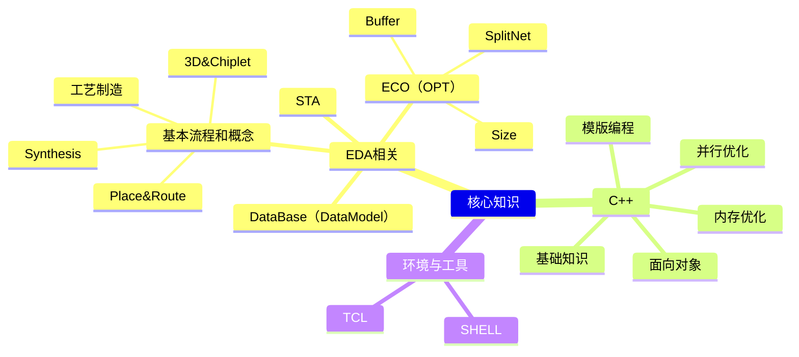

# 学习路线
精进自己的职业技能；（如果有空的话）发展自己的业余爱好。

想让自己成为既专业，又有趣的人。

## 工作知识图谱

以上为我的工作中需要的技能树。以此为基础，我需要制定一些学习计划，持续精进自己的专业技能。

## 一点牢骚

其实，在这个大语言模型飞速发展的时代，个人奋斗在大趋势下已经显得很无力。我希望持续学习和精进，并不是我有多么热爱工作，而是我希望能实现自己的一部分人生价值。也算是找寻自己一部分的存在意义吧，毕竟没有可以纸醉金迷，纵情享受的物质基础，作为一个普通人，只希望能踏踏实实地做点事情。

还有一点不甘心，毕竟在上一家公司整个人也算是受了打击... 害，不提也罢，总之就是调整心态，在如今的公司里能正视自己的工作，获得属于自己的内心平静吧。

## 最近更新

?> last update time: 2026/03/31

### C++：基础知识
- [ ] [【最好的C++教程-The Cherno】-Youtube](https://b23.tv/1Brsqit)，进度16/97（基础但用来查缺补漏）；
- [ ] [【面试经典150题】-LeetCode](https://leetcode.cn/studyplan/top-interview-150/)：进度2/150 ([面试经典150题笔记](code/i150p));
- [ ] [【专项练习-编程语言-C++】-牛客网](https://www.nowcoder.com/exam/intelligent?questionJobId=10&subTabName=intelligent_page&tagId=21003)，进度630/1508（目前错题141，错误率22.38%）；
- [ ] [【C++程序设计-北京大学】-Coursera](https://www.coursera.org/learn/cpp-chengxu-sheji/home/module/3)，进度3/12；
- [ ] [【CoreDumped【中英⚡图解操作系统原理|Operating Systems Theory】-哔哩哔哩】](https://b23.tv/fe97hzi)，进度0/0。

### C++：并行优化
- [ ] [做之前不敢想的 CGraph-Chunel](http://www.chunel.cn/archives/cgraph-unbelievable-2025)（看推荐阅读部分，有框架的简单实现介绍），进度0/18；

### EDA相关：ECO（OPT）
- [ ] 公司内网：ECO及其流程简介，进度1/3；
- [ ] 公司内网：Timing & Mask ECO，进度0/4。

### EDA相关：STA
- [x] [【数字集成电路静态时序分析基础-邸志雄（西南交通大学）】-哔哩哔哩](https://www.bilibili.com/video/BV1if4y1p7Dq)，进度16/16；
- [x] [【新思小课堂-PrimeTime】-哔哩哔哩](https://b23.tv/VrYDx4x)，进度5/5；
- [ ] [【静态时序分析圣经翻译计划-骑猪兜风】-知乎专栏](https://zhuanlan.zhihu.com/p/345536827)，进度1/27。

### EDA相关：基本流程和概念
- [ ] [【VLSI CAD Layout-UIUC】-Coursera](https://www.coursera.org/learn/vlsi-cad-layout/home/module/1)，进度5/5，已拿证书，剩一个编程作业；
- [ ] [【VLSI CAD Logic-UIUC】-Coursera](https://www.coursera.org/learn/vlsi-cad-logic)，进度0/5。

### 其他
- [ ] [【计算机视觉工程师-MathWorks】-Coursera](https://www.coursera.org/professional-certificates/mathworks-computer-vision-engineer)：课程进度0/9；
  - [ ] 课程1-[图像处理入门](https://www.coursera.org/learn/introduction-image-processing/home/welcome)：单元进度0/4；
  - [ ] [MATLAB Onramp](https://matlabacademy.mathworks.com/details/matlab-onramp/gettingstarted)（共2h），进度24%；
- [ ] [【BrainStationAdvanced【中英⚡有趣的机器学习|Interesting Machine Learning】-哔哩哔哩】](https://b23.tv/UcYAH5I)，进度10/13。
