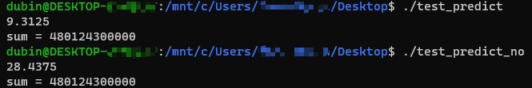
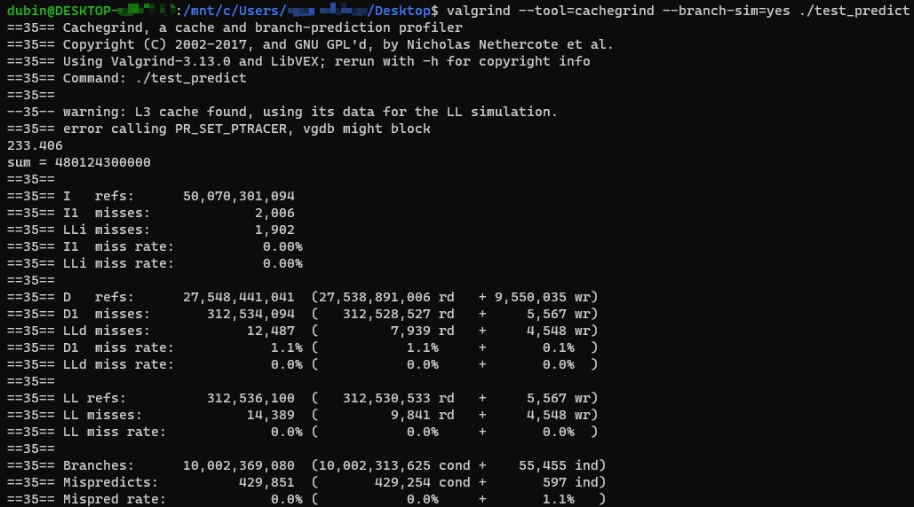
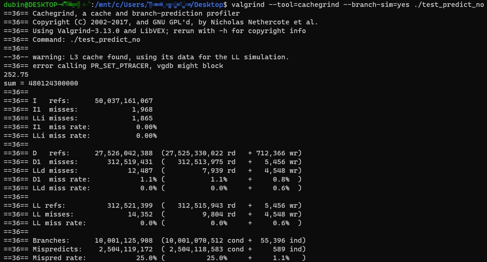
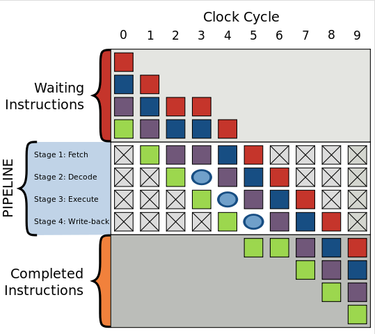

# 优化系列（程序喵）笔记 - 第一篇 工具专题

这是一篇针对[目标文章](https://mp.weixin.qq.com/s/WL-agdox7uNaPe4PV8HgQg)的笔记。

该文章主要介绍了一些用于C++代码检查的工具。

> 工具主要分为**静态代码分析工具**和**动态代码检测工具**。

## 静态代码分析工具

文章中列举了一些静态代码分析工具，其中推荐的是**Clang-Tidy**。除此之外我接触过的还有**cppcheck**。其他工具因为收费就略过了。

还提到了SonarCube代码质量管理平台，因为没有接触过，有待研究。

在Ubuntu18.04（Win10的WSL2）中，这两个工具都可以直接安装：

```bash
sudo apt-get install cppcheck
sudo apt-get install clang-tidy clang
```

使用方法都很简单，基本就是`cppcheck/clang-tidy` + [配置选项] + [源文件] 即可。使用一个简单的C++文件，写一些错误的情况进行测试，确实感觉clang-tidy的提示要更加详尽一些。

> 静态代码分析工具可以在运行前帮助我们检测缺陷，只有30%-70%，但不是所有缺陷，很多缺陷需要在运行时才会被发现。

## 动态分析工具

> 通过动态分析工具可以准确定位问题，而且误报率低，但这与测试用例强绑定，查找缺陷的比例与测试用例的覆盖率有关，覆盖率对于衡量代码质量有很大意义。

我司在去年对代码进行审查的时候，也使用的代码覆盖率（Code Coverage）来作为评价的指标。的确测试用例很重要，测似用例足够多样，才能够覆盖到代码中的各种情况，从而找到代码中可能存在的问题。测试用例过于单一时，很可能会跳过大多数代码。

> 代码覆盖率的意义：
> - 帮助我们找到未覆盖部分的代码，分析测试用例设计的是否充分，之后视情况决定是否可以补充测试用例。
> - 检测出代码的坏味道，提示我们修改代码，理清代码逻辑关系，提升代码质量。
> - 代码覆盖率高不能代表代码质量一定好，但代码覆盖率低，代码质量估计不会高到哪去，可以作为我们衡量代码质量的重要手段之一。
> - 对于没有覆盖到的错误，动态分析工具也无能为力。在实际工作中，我们可以动静结合，多种检查手段全都用上，可以更有效的提升代码质量。 

文章中提到的工具有**GCC&Clang的Santizer系列**，和**Valgrind工具**。对于Santizer系列暂略，主要看一下Valgrind工具：

> - memchek：内存问题，包括Asan和Msan
> - helgrind：线程和并发问题
> - cachegrind、callgrind、massif：帮助进行性能优化

这里使用同作者（程序喵）的一篇文章[少写点if-else吧，它的效率有多低你知道吗？](https://mp.weixin.qq.com/s/m8avve1ahFrf8KJ0n2w8mA)中的代码来测试工具。

代码如下：

```cpp
// test_predict.cc
#include <algorithm>
#include <ctime>
#include <iostream>

int main() {
    const unsigned ARRAY_SIZE = 50000;
    int data[ARRAY_SIZE];
    const unsigned DATA_STRIDE = 256;

    for (unsigned c = 0; c < ARRAY_SIZE; ++c) data[c] = std::rand() % DATA_STRIDE;

    std::sort(data, data + ARRAY_SIZE);

    {  // 测试部分
        clock_t start = clock();
        long long sum = 0;

        for (unsigned i = 0; i < 100000; ++i) {
            for (unsigned c = 0; c < ARRAY_SIZE; ++c) {
                if (data[c] >= 128) sum += data[c];
            }
        }

        double elapsedTime = static_cast<double>(clock() - start) / CLOCKS_PER_SEC;

        std::cout << elapsedTime << "\n";
        std::cout << "sum = " << sum << "\n";
    }
    return 0;
}
```

通过保留/注释`std::sort()`这一行来分别检查程序中的分支预测情况，运行结果的差异：



代码中问题很明显，如果数据经过排序，双重循环中的if在预测时正确率会变高（数据有序，则前一部分都是false而后面全是true）；若未排序则很难预测下一个数据的情况。

> CPU都是多级流水线架构运行，如果分支预测成功，很多指令都提前进入流水线流程中，则流水线中指令运行的非常顺畅，而如果分支预测失败，则需要清空流水线中的那些预测出来的指令，重新加载正确的指令到流水线中执行，然而现代CPU的流水线级数非常长，分支预测失败会损失10-20个左右的时钟周期，因此对于复杂的流水线，好的分支预测方法非常重要。

原文中是使用工具`perf`来展示两种情况下的分支预测结果，使用valgrind工具，需要通过`--branch-sim=yes`把分支预测打开：

```bash
valgrind --tool=cachegrind --branch-sim=yes ./test_predict
```

进行了排序的结果：



没有进行排序的结果：



可以明显看到，如果不进行排序的话，分支预测的失败率直接上升到了25%，由此导致的时钟周期损失很明显了。

下图来自知乎的一篇文章，讲到了分支预测失败时出现的流水线冒泡（bubbling）问题：



图中每个颜色的方块代表一条指令，流水线处理取指、解码、执行、写回四项操作。如果出现分支预测失败，则需要重新取指令，前一条指令（绿色）已经进入了执行阶段，后一条指令（紫色）需要重新取指令，在时钟周期为3时，产生了一个没有失效的气泡，指令运行被延迟。

> 现代CPU流水线级数非常长，分支预测失败可能会损失20个左右的时钟周期，因此对于复杂的流水线，好的分支预测器非常重要。

值得一提的是，[该文章](https://zhuanlan.zhihu.com/p/22469702)提到了使用[bithacks](http://graphics.stanford.edu/~seander/bithacks.html)（需要熟悉位运算相关的操作，提供了一些写法的模板）替代if语句，从而避免了分支预测，消除了是否排序对最终程序的效率的影响。

### Valgrind工具相关

Valgrind工具在运行时可能会报错`error calling PR_SET_PTRACER, vgdb might block`，这个问题是因为程序如果在系统调用（syscall）中阻塞，需要vgdb来唤醒，使用的途径就是`PR_SET_PTRACER`；换言之如果程序不会在syscall中阻塞，则不会出问题；似乎新版本的WSL2已经修复了该问题。(StackOverflow上的回答，参考文章4)

对于Valgrind工具的使用，可以参考一篇专栏：[郭老二-GDB](https://blog.csdn.net/u010168781/category_6998350.html)

## 参考文章
1. [clang-tidy使用](https://blog.csdn.net/u013187057/article/details/103052275)
2. [深入研究Clang(十三) clang-tidy简介](https://zhuanlan.zhihu.com/p/102248131)
3. [Valgrind命令](https://blog.csdn.net/hbhhww/article/details/7168507)
4. [Valgrind showing error calling `pr_set_ptracer`, vgdb might block](https://stackoverflow.com/questions/57206233/valgrind-showing-error-calling-pr-set-ptracer-vgdb-might-block)
5. [深入理解CPU的分支预测(Branch Prediction)模型](https://zhuanlan.zhihu.com/p/22469702)
