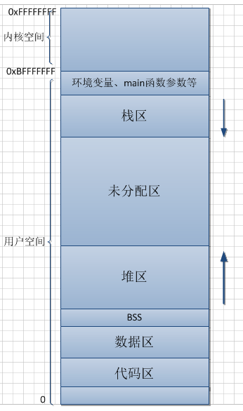
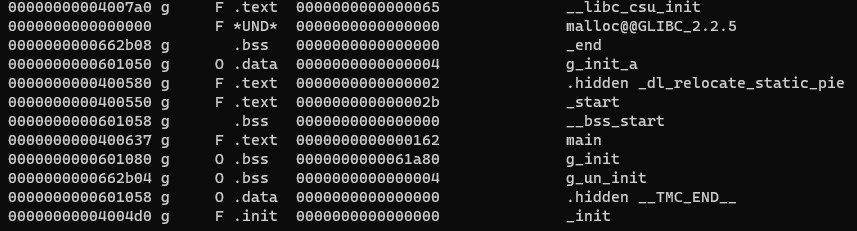
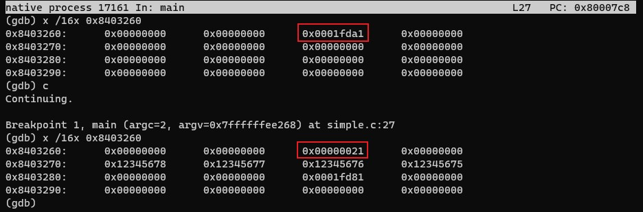

# 阅读笔记：C执行文件内存布局

本文是一篇博客阅读笔记，涉及到的如下几篇博客。内容上基本都是计算机原理的基础知识。
- [C执行文件内存布局](https://blog.51cto.com/12138867/1859029)
- [计算机中浮点数运算的问题](https://blog.51cto.com/12138867/1862273)
- [一道校招笔试的C语言题目](https://blog.51cto.com/12138867/1867440)

## 内存布局

C语言的内存分配、进程在内存中的布局等相关知识，在CSAPP的第一章有简单提到。相应的[笔记](sources/books/csapp/CSAPP_note1)中也有一些记录。后续的章节应该会有详细的讲解，不过目前还没读到那个部分。贴一张博客中的图：



相较于CSAPP中的内存分配图，该图额外标注了：
- 环境变量、main函数参数的位置：其实无需特殊说明，因为main函数肯定是位于栈区并且是栈顶的位置。
- BSS段：通常是至用来存放程序中未初始化的全局变量和静态变量的内存区域。

## 关于BSS段

> 在一些常见的编译器里，通常对BSS段的处理方法是：只描述大小，不增加目标文件的体积。<br>
> 因为变量实际都是内存地址，所以对于属于BSS段的变量，编译器正常设置变量的地址，处理规则没有特别的不同。

关于编译器对BSS段的处理，可通过一个简单的程序测试：
```cpp
int bss[655360];           // 未初始化的全局变量
//int bss[655360] = {-1};  // 初始化的全局变量
int main(int argc, char* argv[]) {
  bss[1] = -1;
  return 0;
}
```
是否初始化`bss`这个变量，将会影响可执行文件的大小。

> 负责将BSS段清零的工作一般是由加载器完成的，当一个可执行文件被加载的时候，加载器（可以简单地理解为操作系统）负责把BSS段的内存清零。

## 简单C程序测试内存布局

C程序代码如下（内存布局的结果写在了注释中）：
```cpp
#include <stdio.h>
#include <stdlib.h>
#include <string.h>

#define STR_SIZE 32

int g_un_init;                      // 未初始化的全局变量，bss段
int g_init[100000] = {0};           // 初始化为0的全局变量，bss段；如果初始化非0，则data段
int g_init_a = 521;                 // 初始化的全局变量，data段
static int g_static_data = 125;     // 静态全局变量，data段

int main(int argc, char** argv) {   // 函数参数，栈
  int local_a;                      // 临时变量，栈
  static int local_static_b;        // 静态临时变量，data段
  char *str = "xiaozhu";            // 字符串常量，data段
  char *local_str = NULL;           // 临时变量，栈
  
  local_str = malloc(STR_SIZE);     // 动态分配内存，堆
  if (local_str == NULL) {
  	printf("no mem \n");
  	return -1;
  }
  
  printf("argv[1] = %p \n", argv[1]);
  printf("g_un_init = %p \n", &g_un_init);
  printf("g_init = %p \n", g_init);
  printf("g_init_a = %p \n", &g_init_a);
  printf("g_static_data  = %p \n", &g_static_data);
  printf("local_a = %p \n", &local_a);
  printf("local_static_b = %p \n", &local_static_b);
  printf("str = %p \n", str);
  printf("local_str = %p \n", local_str);
  
  free(local_str);
  return 0;
}
```
在使用博客中提到的方法测试时，通过`readelf`的相关命令，无法正确获取可执行文件elf中的各段地址。对比`readelf -h a.out`的结果可以发现，同样是`gcc -o test.c`，我本地的版本gcc7.5.0编译出elf文件的type是`DYN (Shared object file)`，而原文中是`EXEC (Excutable file)`。查了一下相关文章，原因如下：

> gcc默认加了`--enable-default-pie`选项；可通过加上`-no-pie`来禁用该默认选项。

> 引入PIE的原因是让程序能装载在随机的地址，通常情况下，内核都在固定的地址运行，如果能改用位置无关，那攻击者就很难借助系统中的可执行码实施攻击了。类似缓冲区溢出之类的攻击将无法实施。而且这种安全提升的代价很小。

通过命令`gcc -o test.c -no-pie`重新编译，即可得到type为EXEC的elf可执行文件。通过`objdump -t a.out`可查看elf文件中的符号表：



图中仅截取了结果中的一部分。从这部分中可以看出，未初始化和初始化为0的全局变量`g_un_init`、`g_init`位于bss段，而初始化的全局变量`g_init_a`位于data段。

当然也可以通过博客中提到的`readelf -S a.out`，显示各段的范围，结合程序的结果来验证内存的分布，这里就不再赘述。总结一下`readelf`和`objdump`的方法：
> - 用`readelf -s a.out`或`objdump -t a.out`查看符号表（各符号位置、大小）
> - 用`readelf -S a.out`或`objdump -h a.out`查看段表（各段的位置、大小）

> 向只读段、内核空间、未分配区赋值都会引发段错误（Segmentation Fault）

## malloc和free

在堆上分配内存时，经常会用到malloc和free（C语言）。相较于由系统自动分配内存、速度较快的栈，不仅速度比较慢，同时也容易产生内存碎片。

在Windows平台上，在堆上分配内存最好是使用`VirtualAlloc`。这是Windows的一个API，在进程的地址空间内保留一块内存（既不是在堆上也不是在栈上），速度快且比较灵活。

**思考**：为什么malloc需要指定分配的大小，而free只需要一个地址参数？

> 当调用`malloc(size)`时，实际分配的内存大小大于`size`字节，这是因为在分配的内存区域头部有类似于：
```cpp
struct control_block {
  unsigned size;
  int used;
};
```
> 这样的一个结构，如果malloc函数内部得到的内存区域的首地址为`void *p`,那么它返回给你的就是`p + sizeof(control_block)`，而调用free(p)的时候，该函数把p减去`sizeof(control_block)`，然后就可以根据`((control_blcok*)p)->size`得到要释放的内存区域的大小。<br>
这也就是为什么free只能用来释放malloc分配的内存，如果用于释放其他的内存，会发生未知的错误。

写了一个简单的程序，在gdb下查看了malloc分配的指针前几个字节的内存：
```cpp
int main(int argc, char* argv[]) {
  int n = 1;
  if (argc == 2) n = atoi(argv[1]);
  int * p = (int *)malloc(sizeof(int) * n);
  for (int i = 0; i < n; ++i) *(p + i) = 0x12345678 - i;
  printf("p = 0x%x\n", p);
  free(p);
  return 0;
}
```
通过输入参数直接控制分配内存的大小。在gdb中可以看到：



的确在malloc返回的地址前的一块内存发生了变化，如果改变分配的内存的大小其数值也会随之变化。

## 计算机中浮点数运算的问题

例子就不用了，情况是浮点数多次运算（累加）结果出现偏差。原因就是浮点数的精度有限，对于有些不能精确表示的数字（如0.1）多次运算会导致偏差累计。

CSAPP公开课的第一节中也简单举了一个例子：`(1e20 - 1e20) + 3.14`和`1e20 + (-1e20 + 3.14)`在数学上是相等的，但用有限精度的浮点数运算结果就不相同，后一个因为`1e20`和`3.14`差距过大导致精度截取，`3.14`就会被丢掉导致第二个表达式的结果为0.000000。

## 一道校招笔试的C语言题目

代码如下：

```cpp
struct test {
  int a;
  int * c;
};
struct test b;
b.a = 300;
b.c = 500;
printf("%d", b.a + b.c);
```
正确答案是1700。只要理解了指针的偏移所代表的意义，就能正确解答。首先要注意到`c`是一个`int *`的指针，`a`是`int`类型的整数，最后的结果是**指针+整数**的形式。`b.c = 500`即指针的值为500，`int`类型为4个字节，`int *`指针每次+1时要跳过当前的`int`并寻找下一个，会向后移动4个字节。因此最终的结果是`500 + 300*4 = 1700`，是很基础的问题。

## 参考文章
1. [bss段是什么，用到bss段的整个流程是怎么的？](https://www.zhihu.com/question/23059602)
2. [关于Linux下gcc编译C源文件时，生成的是Shared object file而不是Executable file](https://blog.csdn.net/cclethe/article/details/83387685)
3. [面试官问我：bss段的大小记录在哪里？](https://bbs.csdn.net/topics/390613528)
4. [为什么malloc时需要指定size，对应的free时不需要指定size？](https://www.zhihu.com/question/20362709)
5. [关于堆栈的讲解](https://blog.csdn.net/yingms/article/details/53188974)
