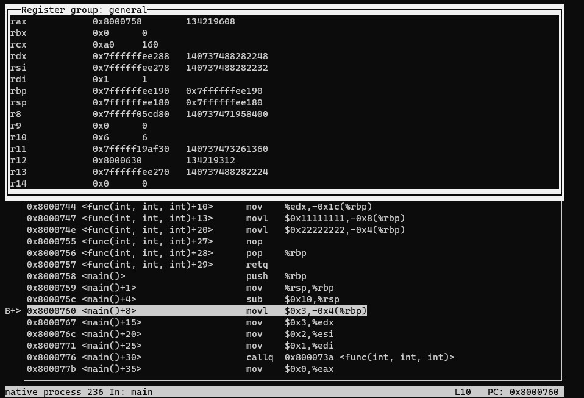
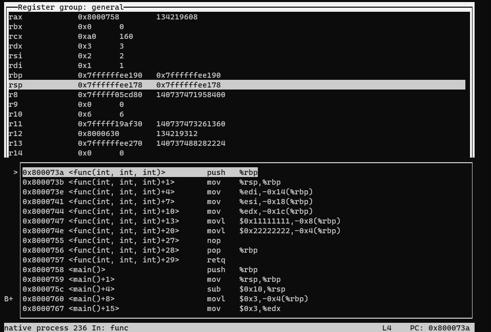
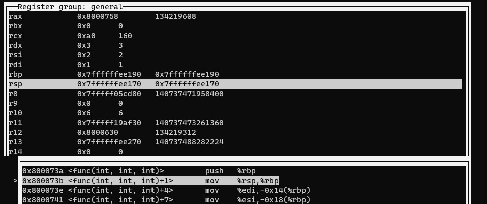
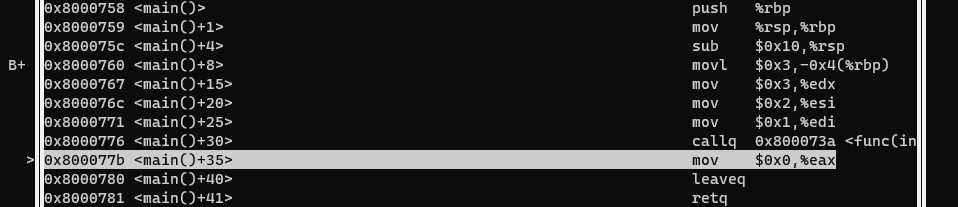

# 每日博客笔记 4.25.2021

博客地址：[C++函数调用过程深入分析](https://blog.csdn.net/dongtingzhizi/article/details/6680050)。来自于微信公众号“C语言CPP编程”的每日推文，对该文章进行了转载。

## 原文知识点

原文通过一个简单的程序，在VC6.0中查看分析汇编代码，对函数调用过程进行了分析解释。本文将同样通过这个程序，在Linux下通过gdb实现相同的流程。（g++ version 7.5.0，gdb version 8.1.1，Ubuntu 18.04，64bit）

代码如下：
```cpp
#include <iostream>
using namespace std;
void func(int a, int b, int c) {
  int x = 0x11111111;
  int y = 0x22222222;
}
int main() {
  int z = 3;
  func(1, 2, 3);
  return 0;
}
```
需要用到的gdb命令：
- `layout asm` 显示汇编源码
- `layout regs` 显示寄存器的状态
- `ni`/`si` 汇编代码单步调试/单步进入

### 函数调用
将断点加到函数调用之前的位置，即`int z = 3;`的位置。运行gdb，显示汇编源码和当前的寄存器状态：



其中一些寄存器的个人理解：
- rsp是堆栈寄存器，rbp是基地址寄存器，当前的函数中变量的范围就在rsp和rbp之间；
- rip是指令指针寄存器，指向当前汇编代码的位置；

以变量z为例，通过`p &z`命令查看其地址为0x7ffffffee18c，此时rsp = 0x7ffffffee180，rbp = 0x7ffffffee190。栈顶为rsp，栈底为rbp（栈从高地址到低地址增长），变量z刚好在该范围之内。`-0x4(%rbp)`即rbp地址减去四个字节，运算之后刚好是变量z的地址0x7ffffffee18c，四个字节也是int的大小。因此`movl $0x3, -0x4(%rbp)`这条指令的内容就是，将变量z所在的地址赋值为0x3，即z=3。

对于局部变量，系统将其分配到栈上，并且按照定义的顺序逐个入栈。因此z最先入栈，位于靠近栈底的位置。

对z赋值完成之后，就开始进行函数调用。对于传递参数较少的情况，直接通过寄存器来保存参数。按照参数从右到左的顺序，依次使用edx、esi、edi三个寄存器保存了参数3、2、1。然后通过`callq`命令进行函数调用，通过调试命令`si`进入func函数的汇编代码。



可以看到，`callq`指令执行本身就会引起堆栈寄存器rsp发生变化（0x7ffffffee178)，因为是64位系统，所以指针的大小为8个字节，刚好是堆栈指针增长一次。查看堆栈指针指向的内存:
```shell
(gdb) `x /2x $rsp`：
0x7ffffffee178: 0x0800077b 0x00000000
```

测试平台Ubuntu 18.04采用的是小端模式，因此堆栈指针指向的内容拼接起来是：0x000000000800077b。从汇编代码中可以发现，0x800077b刚好是`callq`这行代码的下一行，即保存了函数调用结束之后要继续运行的位置。

> 从物理上来说，CALL指令将其返回地址压入堆栈，再把被调用过程的地址复制到指针指令寄存器。

> 这一步也是常说的函数中断前的“保护现场”，实际上是将rip（指令指针）压栈，即隐含地执行了一条`push $rip`指令（因此rsp会发生变动），在中断函数返回时再从栈中弹出该值恢复到rip，程序继续向下执行。

进入func()函数的内部，首先执行`push $rbp`。执行push或pop指令会直接影响rsp的值，push时向下增长一次，pop时向上减少一次。因此这一步之后，rsp的值变成了x7ffffffee170。



前面有说过rbp和rsp之前的地址就是当前函数所占用的栈底和栈顶，函数中用到的临时变量的地址都位于这个范围。到了func()函数内部，自然要重新确定函数的边界，因此先将main函数的rbp入栈保存，然后`move $rsp, $rbp`，即原来main函数的栈顶作为func函数的栈底。

**注意**：这部分和博客原文中的结果不太一致，原文中还有一条`sub $esp, 48h`的指令，即将堆栈指针向下移动48h Byte，考虑到将要分配的两个整型变量（各自4Byte），相当于rsp和rbp之间预先放置了一个大小为40h（64）Byte的间隔空间。而在GDB中调试时，进入函数调用并未有这一指令，此时rsp和rbp一直保持相等。大概是因为func的功能过于简单，分配的变量所占内存较少，因此并不需要额外分配间隔空间？
<font color = red>（原因待查）</font>

<font color = blue>
参考文章1的结论：这里不知道为什么没有sub xx,$rsp，我猜测是gcc发现这个最后一次函数调用，之后不会有栈的增长只会有栈的回退，所以用%rsp和%rbp的结果是一样的。简单验证了下，应该是这样。
</font>

从保存参数的三个寄存器（edx、esi、edi）中获取参数c、b、a的值，放在了地址`-0x14(%rbp)`、`-0x18(%rbp)`、`-0x1c(%rbp)`三个位置，然后紧邻rbp的位置`-0x4($rbp)`和`-0x8($rbp)`给变量x、y分配了内存。

在变量c和变量y之间，有着8Byte的间隔。通过`x /2x 0x7ffffffee160`查看了一下，发现这里存着一个指针0x7fffff410b40。再次查看该指针指向的内容，发现在gdb中，显示其地址后面跟着一个`<_dl_fini>`的标识。不太清楚该指针的含义，简单搜索之后感觉和exit()函数相关。
<font color = red>（待研究）</font>

<font color = blue>
参考文章3中提及：exit会调用dl_fini函数。
</font>

至此，func函数体内的代码执行完毕，接着就要返回main函数。首先要恢复现场，通过`pop $rbp`来还原main函数的栈底位置。因为示例较简单，并没有其他的恢复工作（正常来说要寄存器的内容都要恢复，但示例并没有修改什么寄存器，用到的寄存器都是用来传递参数的）。

pop指令之后，rsp的内容也发生了变化，其内容刚好是执行`callq`时存储的main函数下一条指令的位置。执行`retq`，`retq`命令与`callq`相对应，也会隐含地执行一条`pop $rip`，将指令指针寄存器的值恢复，返回main函数。此时rsp也刚好位于调用func函数之前的位置，至此，函数调用完成。



通用寄存器eax有传递函数返回值的功能。在main函数结束之前，执行`mov 0x0, $eax`然后执行`leaveq`，就是将`return 0`这行代码中的0放到eax寄存器中，然后返回。

### 思考
- 毕竟选用的工具不同，原文中使用VC6.0而本文用的GDB，反汇编代码有所差异，但整体上来说差别不大。
- 遗留了两个问题，一个是间隔空间分配，另一个是指向内存标识为`<_dl_fini>`的指针。
- 示例代码过于简单，参数个数不多、传递进来后没有使用、并且没有返回值。

## 参考文章
1. [GDB单步调试汇编](https://www.cnblogs.com/zhangyachen/p/9227037.html)
2. [汇编语言CALL和RET指令：调用一个过程](http://c.biancheng.net/view/3537.html)
3. [de1ctf_2019_unprintable(_dl_fini的l_addr劫持妙用)](https://blog.csdn.net/seaaseesa/article/details/106695358)
