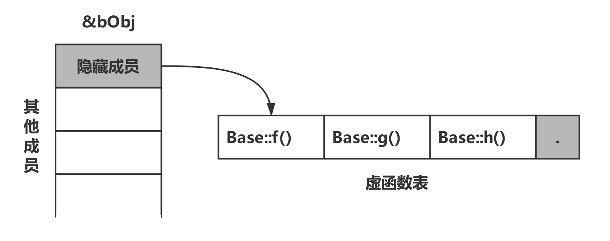
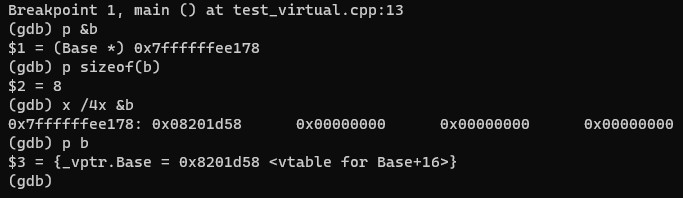
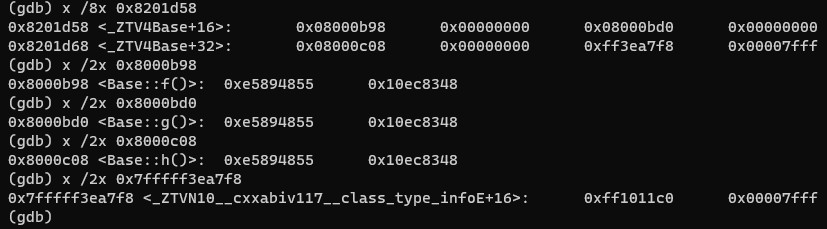
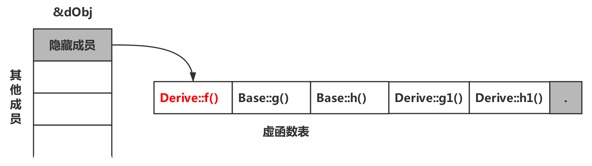

# 每日博客笔记 4.28.2021

博客地址：[C++虚函数表原理浅析](https://www.cnblogs.com/zhxmdefj/p/11594459.html)。来自于微信公众号“C语言CPP编程”的每日推文，对该文章进行了转载。

## 原文知识点

> C++中的虚函数实现了多态的机制，也就是**用父类型指针指向其子类的实例**，然后通过父类的指针调用实际子类的成员函数，这种技术可以让父类的指针有“多种形态”，这也是一种泛型技术，也就是**使用不变的代码来实现可变的算法**

### C++的内存分区
栈、堆、自由存储区、全局/静态存储区、常量存储区

这里有一个**自由存储区**的概念，原文是：
> 由`new`分配的内存块，由程序员释放（编译器不管），一般一个`new`与一个`delete`对应，一个`new[]`与一个`delete[]`对应，如果程序员没有释放掉，资源将由操作系统在程序结束后自动回收.

将由`malloc`申请`free`释放的内存块所在的区域定义为堆，相对地将`new`和`delete`处理的内存块定义为自由存储区，感觉上似乎可以统称为“堆”。
<font color=red>（合理性待查）</font>

### 虚函数表
虚函数表是虚函数实现的一种方式（暂时还未接触到其他方式），与编译器相关。不同的编译器可能会使用非虚函数表的方式实现虚函数。

虚函数表实现虚函数的原理：
> 为每个类对象添加一个隐藏成员，隐藏成员保存了一个指针，这个指针叫虚表指针（vptr），它指向一个虚函数表（virtual function table, vtbl）

> 虚函数表就像一个数组，表中有许多的槽（slot），每个槽中存放的是一个虚函数的地址（可以理解为数组里存放着指向每个虚函数的指针）

**每个类使用一个虚函数表，每个类对象使用一个虚表指针**

如图所示（图片来自原始博客）：


派生类如果对基类的虚函数进行了重写，那么派生类的虚函数表也会进行更新。

### 找到虚函数表
先看示例代码：
```cpp
class Base {
  public:
    virtual void f() { cout << "Base::f" << endl; }
    virtual void g() { cout << "Base::g" << endl; }
    virtual void h() { cout << "Base::h" << endl; }
};
typedef void(*Fun)(void);
int main() {
  Base b;
  Fun pf = NULL;
  cout << "VTable addr = " << (long*)(&b) << endl;
  cout << "1st function address in VTable = " << (long *)*(long*)(&b) << endl;
  pf = (Fun)*((long*)*(long*)(&b));
  pf();
  return 0;
}
```
针对测试的64位系统修改了部分代码，将原文中`int *`指针都修改成了`long *`。直接进入GDB调试，在`Fun pf = NULL`这一行加断点，打印变量b的一些信息：



可以看到，`class B`的对象b大小为8个字节，仅仅一个指针的大小（再次强调，64位系统）。这是因为这个类中只有虚函数而没有其他成员，因此只分配了一个虚函数表的指针`0x8201d58`。并且直接打印变量b的信息，GDB也会给出这个虚函数表的指针。

查看该指针指向的信息：



可以看到，该指针指向的区域有连续的三个函数指针，各自指向的函数刚好是`Base::f`、`Base::g`和`Base::h`，这个区域就是虚函数表。至于最后一个指向其他信息的指针，个人倾向于认为与虚函数表无关。
<font color=red>（待查证）</font>

了解了虚函数表在内存中的排列，现在来看程序中与`Fun`相关的部分。`Fun`被定义为一个输入参数为空，返回参数为空的函数指针。`(long *)(&b)`就是将变量b的指针解析为一个8字节的指针，得到虚函数表的指针；`*((long*)(&b))`访问了虚函数表指针指向的内容，即虚函数表；`(long *)*((long *)(&b))`取虚函数表中的8个字节，解析为一个指针，即虚函数表中的第一个函数指针，即`Base::f`。

如果要通过`Fun`实现对函数的调用，只需要通过`(Fun *)((long *)*((long *)(&b)))`。依次类推，如果想要获取`Base::g`，只需要`(Fun) * ((long *)*((long*)(&b)) + 1)`即可。

### 继承情况下的虚函数表
示例代码中仅有一个基类，在单继承、多继承的情况下，虚函数表内部又是如何排列的？下面将分情况进行测试。

#### 单继承（无重写）
保持示例代码中的`class Base`不变，添加`class Derive`，通过`Fun`的方式调用虚函数表中的函数:
```cpp
class Derive : public Base {
  public:
    virtual void f1() { cout << "Derive::f1" }
    virtual void g1() { cout << "Derive::g1" }
    virtual void h1() { cout << "Derive::h1" }
};
typedef void(*Fun)(void);
int main() {
  Derive d;
  Fun pf = NULL;
  for (int i = 0; i < 6; ++i) {
    pf = (Fun)*((long*)*((long*)(&d)) + i);
    pf();
  }
  return 0;
}
```
运行结果为：
```bash
$ ./test
Base::f
Base::g
Base::h
Derive::f1
Derive::g1
Derive::h1
```
可以看到，按照定义的顺序，依次按照基类、派生类将虚函数排列到虚函数表中，比较直观。
#### 单继承（有重写）
修改`class Derive`的代码，重写`f()`函数：
```cpp
class Derive : public Base {
  public:
    virtual void f() { cout << "Derive::f" }
    virtual void g1() { cout << "Derive::g1" }
    virtual void h1() { cout << "Derive::h1" }
};
```
运行结果为：
```bash
$ ./test
Derive::f
Base::g
Base::h
Derive::g1
Derive::h1
Segmentation fault (core dumped)
```
可以看到虚函数表中的`f()`函数已经替换为`Derive::f()`。如图所示（图片来自原文）：



在这里与原文出现差异，VS将虚函数表末尾的位置设置为`NULL`，而g++编译的结果中虚函数表末尾有其他指针（上文中有提到），不能随意访问，因此出现段错误。

#### 多继承（无重写）
修改基类与`class Derive`的继承结构：
```cpp
class Base1 {
  public:
    virtual void f() { cout << "Base1::f" << endl; }
    virtual void g() { cout << "Base1::g" << endl; }
};
class Base2 {
  public:
    virtual void f() { cout << "Base2::f" << endl; }
    virtual void g() { cout << "Base2::g" << endl; }
};
class Derive : public Base1, Base2 {
  public:
    virtual void f1() { cout << "Derive::f1" << endl; }
    virtual void g1() { cout << "Derive::g1" << endl; }
};
```

## 参考文章
