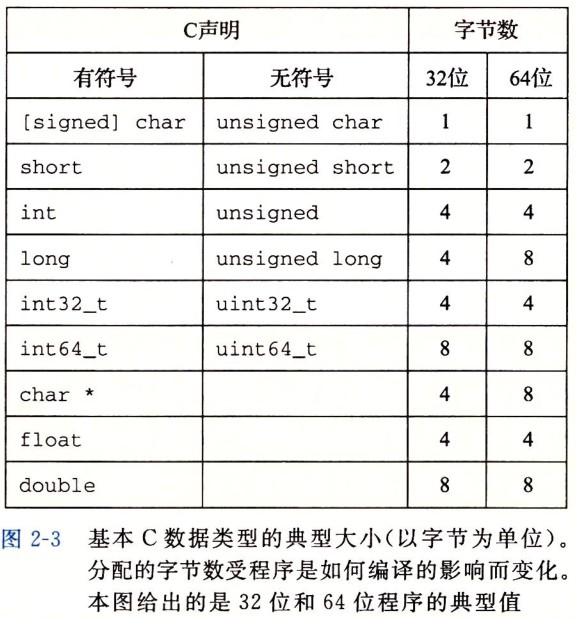

# 信息的表示和处理

整数的溢出测试（32位机器）：

```cpp
int a = 200*300*400*500;
cout << a << endl;
```

浮点数的不可交换测试：

```
cout << (3.14 + 1e20) - 1e20 << endl;
cout << 3.14 + (1e20 - 1e20) << endl;
```

编译器会试图优化算术表达式求值的性能。

数制转换，略。

字长（word size）：指明指针数据的标称大小。对于一个`w`位的机器而言，虚拟地址的范围为`0~2^w - 1`，程序最多访问`2^w`个字节。

> 32位字长限制虚拟地址空间为4GB；64位字长使虚拟地址空间位16EB，大约是`1.84*10^19`。

4GB内存对于32位电脑足够使用，再扩展也无意义。

不同的数据类型在不同字长的机器上的内存大小：



类型`int32_t`和`int64_t`在不同机器与编译器上大小一致。

跨平台编译（如32位编译64位程序）：

```
gcc -o prog prog.c -m64
```


