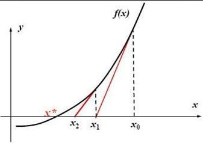

# 牛顿迭代法求开平方
给出一个非负整数x，计算其平方根（LeetCode No.69 x的平方根）完全可以使用二分法，代码如下：
```cpp
int Sqrt(int x) {
  int l = 0, r = x, ans = 0;
  while (l <= r) {
    long mid = l + (r - l) / 2;
    if (mid * mid <= x) {
      ans = mid;
      l = mid + 1;
    } else {
      r = mid - 1;
    }
  }
  return ans;
}
```
需要注意平方运算可能超出int类型的范围，所以计算前换成了long。

这里求出的是整数近似解，如果要求是浮点数就要修改变量类型，以及判断条件；同时l和r的变化条件也要修改。

牛顿迭代法是数学解法，原理是通过解附近点的切线与x轴的交点，不断逼近最终解。示意图如下：



牛顿迭代法求一般函数的解时，是有一些限制的（相关内容见参考文章）：
> - 函数在整个定义域内最好是二阶可导的
> - 起始点对求根计算影响重大，可以增加一些别的判断手段进行试错

仅用来计算开平方则满足这些限制。下面对迭代公式进行简单推导。

函数 $f(x)=x^2-C$ 是二次函数，当 $f(x)=0$ 时，$x$ 的解就是常数 $C$ 的开平方。

对于这个二次函数上的任一点 $(x_0,y_0)$，切线的斜率为 $f'(x_0)=2x_0$，进而求出该点切线的方程（点斜式）：
$$
y-y_0=2x_0(x-x_0)
$$
这条切线与x轴的交点（令 $y=0$）：
$$
x_i=-\frac{y_0}{2x_0}+x_0=\frac{x_0^2+C}{2x_0}=0.5\ast(x_0+\frac{C}{x_0})
$$
这就是 $x_i$ 的迭代公式。通过不断迭代，直到 $x_i$ 的变化足够小，例如 $|x_i-x_0|<10^{-7}$，就可以得到一定精度下的精确解。

根据迭代公式，可以写出牛顿迭代法求开平方的代码：
```cpp
int Sqrt(int x) {
  if (x == 0) return 0;
  double C = x, x0 = x;
  while (true) {
    double xi = 0.5 * (x0 + C / x0);
    if (fabs(x0 - xi) < 1e-7) break;
    x0 = xi;
  }
  return int(x0);
}
```
## 参考文章
1. [如何通俗易懂地讲解牛顿迭代法求开方？数值分析？-马同学的回答](https://www.zhihu.com/question/20690553)
