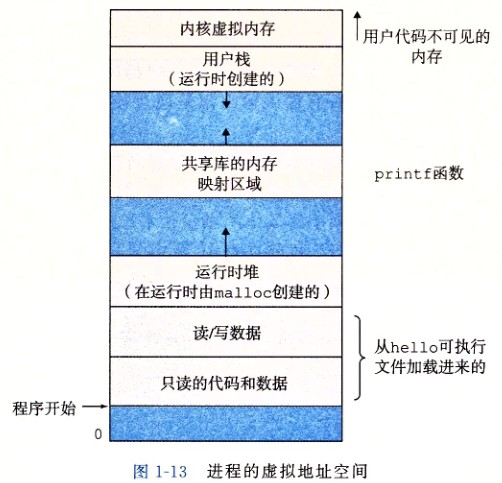

# CSAPP

## 第一章 计算机系统漫游

### 编译系统

编译系统的组成：预处理器、编译器、汇编器和链接器

源文件 hello.c

预处理阶段：将#开头的头文件内容插入到文本文件中，得到（通常）hello.i

编译阶段：将文本文件翻译成汇编语言程序，得到hello.s

汇编阶段：将汇编语言程序翻译成机器语言指令，得到hello.o

链接阶段：将预编译的文件printf.o和hello.o进行链接，得到最终的可执行文件

Syntax Error、Compile Error出现在编译阶段

Runtime Error出现在运行阶段

了解编译系统可以优化程序性能，理解链接时出现的错误，以及避免安全漏洞。

### 硬件系统

总线

I/O设备

主存

处理器：解释或执行存储在主存中指令的引擎。

处理器的核心是一个大小为一个字的存储设备（或寄存器），成为程序计数器（PC），在任何时刻，PC都指向主存中的某条机器语言指令（即含有该条指令的地址）

> 此处待详细补充

加载、存储、操作、跳转

指令集架构：描述每条机器代码指令的效果

微体系结构：描述处理器实际上是如何实现的

> 待补充

高速缓存至关重要：高速缓存存储器（cache memory）

存储器层次结构：（更小、更快、更贵 -> 更大、更慢、更便宜）

1. 寄存器
2. 高速缓存（SRAM）L1、L2、L3
3. 主存（DRAM）
4. 本地二级存储（本地磁盘）
5. 远程二级存储（分布式文件系统，Web服务器）

意识到高速缓存存储器存在的应用程序员能够利用高速缓存将程序的性能提高一个数量级。

### 操作系统管理硬件

向应用程序提供简单一致的机制来控制复杂而又通常大不相同的低级硬件设备。通过几个基本的抽象概念（进程、虚拟内存和文件）来实现

#### 进程

进程是操作系统对一个正在运行的程序的一种抽象，并发运行则是说一个进程的指令和另一个进程的指令是交错执行的。

操作系统保持跟踪进程运行所需的所有状态信息，这种状态也称为上下文。

从一个进程到另一个进程的转换是由操作系统内核管理的，内核是操作系统代码常驻主存的部分。内核不是一个独立的进程，而是系统管理全部进程所用代码和数据结构的集合。

#### 线程

一个进程实际上可以由多个执行单元（线程）组成，每个线程都运行在进程的上下文中，并共享同样的代码和全局数据。

#### 虚拟内存

虚拟内存是一个抽象概念，为每个进程提供一个假象，即每个进程都在独占地使用内存。每个进程看到的内存都是一致的，称为虚拟地址空间。

对于所有进程来说，代码是从同一固定地址开始的。

虚拟地址空间从低地址开始，依次为：

1. 程序代码和数据
2. 堆
3. 共享库
4. 栈
5. 内核虚拟内存

所以可以通俗的说，堆向上长（从低地址到高地址）、栈向下长（从高地址到低地址）。这个CSAPP上的原图看起来更加方便理解。

栈是一种线性结构，堆是一种链式结构。

基本思想是把一个进程虚拟内存的内容存储在磁盘上，然后用主存作为磁盘的高速缓存。

虚拟内存是对程序存储器的抽象。

#### 文件

文件就是字节序列。是对I/O设备的抽象。

### 系统之间利用网络通信

现代系统经常通过网络和其他系统连接到一起。从一个单独的系统来看，网络可视为一个I/O设备。

### 重要主题

系统是硬件和系统软件互相交织的集合体，必须共同协作以达到运行应用程序的最终目的。

#### Amdahl定律

想要显著加速整个系统，必须提升选系统中相当大的部分的速度。

#### 并发和并行

并发（concurrency）：同时具有多个活动的系统

并行（parallelism）：并发来使一个系统运行得更快

线程级并发：使用线程，能够在一个进程中执行多个控制流

超线程：即同时多线程，是一项允许一个CPU执行多个控制流的计数。其实就是常说的双核心四线程，则每个核能够并行地执行两个线程。

超线程的处理器可以在单个周期的基础上决定要执行哪个线程，而常规处理器需要大约20000个时钟周期才能完成不同线程之间的切换。

每个核都有自己的L1、L2级缓存，所有核共享L3级缓存。

指令级并行：现代处理器可以同时执行多条指令的属性。

流水线将是一个比较重要的概念。

如果处理器可以达到比一个周期一条指令更快的执行效率，就称之为超标量处理器。

单指令、多数据并行：在最低层次上，许多现代处理器拥有特殊的硬件，允许一条指令产生多个可以并行执行的操作，称之为单指令、多数据，即SIMD并行。

较可靠地利用SIMD并行的方式是使用编译器支持的特殊的向量数据类型来写程序。

#### 计算机系统中抽象的重要性

在处理器里，指令集架构提供了对实际处理器硬件的抽象。

