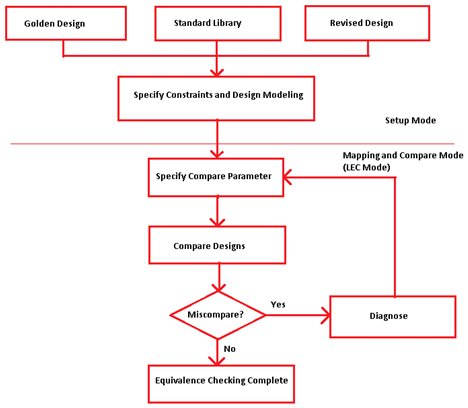
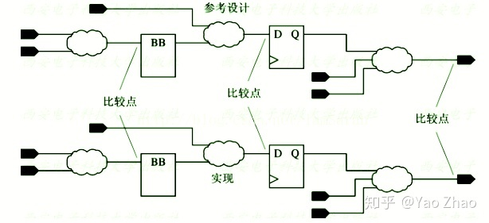
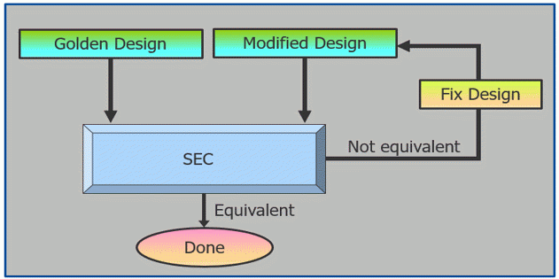

# 逻辑等价性检查（Logical Equivalence Checking）

主要参考：**A Guide on Logical Equivalence Checking - Flow, Challenges, and Benefits** [英文原文地址](https://www.design-reuse.com/articles/45547/a-guide-on-logical-equivalence-checking-flow-challenges-and-benefits.html)

> VLSI的设计周期分为两个阶段：前端和后端。前端涵盖架构规范、编码和验证，而后端涉及*目标制程技术节点上*设计的物理实现。

目标制程技术节点：半导体制程技术节点，22nm、14nm、10nm、7nm。根据摩尔定律，，新一代的制程要比上一代的面积减小约一半。例如`(14 * 14) / (10 * 10) ~= 2`。

> 本文主要介绍LEC（逻辑等效检查）在ASIC设计周期中的重要性，如何进行检查以及当LEC失败时该怎么做。通过一个测试用例，展示如果LEC失败会发生什么，如何查明问题以及采取哪些措施来解决问题。

## LEC的重要性

> - ASIC在流片之前，要经历一系列设计步骤，如综合、布局布线、签核（sign-offs）、ECO（工程变更单）以及众多优化过程。在每个阶段，我们都需要确保逻辑功能完好无损，并且不会因为任何自动或手动更改而中断。如果功能在整个过程中的任何时刻发生变化，整个芯片就变得毫无用处。这就是为什么LEC是整个芯片设计过程中最重要的原因之一。
> - 随着制程技术节点的缩小和复杂性的增加，逻辑等效检查在确保功能的正确性方面起着重要作用。

> LEC包括三个步骤，如下图所示：设置模式，映射模式和比较模式。

> 有各种用于执行LEC的EDA工具，例如Synopsys Formality和Cadence Conformal。这里，我们将Conformal工具作为参考，以解释LEC的重要性。

我司主要用的工具时S家的Formality，因此后面涉及到Conformal的地方会替换成Formality，关于Conformal的内容可参考英文原文。

## 逻辑等效检查的步骤

让我们仔细看看逻辑等价检查的各个步骤：

### 1）设置

> 在设置模式下，验证工具读取两个设计。我们指定设计类型，即参考设计（Golden）和修订版（Revised）进行验证。

在前端进行综合工具开发时，通常以原始的verilog涉及作为Golden，综合后的网表作为Revised，通过LEC来验证综合工具的正确性。

> 在从设置模式到LEC模式的过渡中，验证工具展平Golden和Revised的设计并自动映射关键点。关键点定义为：

> 1. 主要输入，即顶层输入
> 2. 主要输出，即顶层输出
> 3. D Flip-Flops，即DFF，寄存器
> 4. D Latch，即锁存器
> 5. TIE-E门（错误门，在修订设计中存在x赋值时创建）
> 6. TIE-Z门（高阻抗或浮动信号）
> 7. 黑盒，即仅有输入输出端口而无内部实现的单元

### 2）映射

> 在等效性检查的第二阶段，验证工具自动映射关键点并进行比较。比较完成后，它会确定差异。Conformal工具使用两种基于名称的方法和一种无名方法来映射关键点。当对逻辑进行微小更改时，基于名称的映射对于gate-to-gate比较非常有用。

> 相反，当Conformal工具必须使用完全不同的名称映射设计时，无名映射方法很有用。默认情况下，它会在退出设置模式时使用名称优先映射方法自动映射关键点。Conformal工具未映射的关键点被归类为未映射的点。

以上是Conformal的关键点映射方案，暂时未查到Formality的验证方案，原理上应该差不多。

未映射的情况有：
 
- extra unmap：额外未映射的点是仅在其中一个设计（Golden或Revised）中出现的关键点。
- unreachable：无法到达的未映射点与设计的顶层输出没有直接到达的路径。

通常情况下RTL中会有很多冗余产生extra unmap。

### 3）比较

> 映射关键点之后，验证的下一步是比较是否等效，有如下几种情况：
> 
> - 等效
> - 逆等效（Inverted-equivalent）
> - 非等效
> - 中止（工具无法比较）

前两种情况都表示等效。

> 除了这两种情况之外，还有一种Sequential-merge（写了两端代码功能上比较接近，验证工具就会把这两段代码融合到一起。比如第一段代码有20个触发器，有5个是冗余的，最后会把它合并成15个，以减少面积），这种情况也是等效的。

Formal的报告：

- report mapped points
- report unmapped points
- report compare data
- report black box

> 图形化界面可以打开电路进行对比，更有利于debug。

Formal在进行形式验证时依赖svf文件，这个文件描述了Revised相对于Golden的一些关键点修改（主要是寄存器）。

chenliang在离职前的最后一个任务就是在综合后生成用于Formal的svf文件，当时说得好像很着急，现在也不知道我司的硬件组Formal的流程推进到哪里了。

> 工具把整个等价性检查工具拆分为一系列两个参考点之间的组合逻辑的等价性验证，可以让整个工作高效完成。当然，这只是简单的易于理解的说法，实际上里面会有很多的加速手段。

> CEC（Combinational Equivalence Check）在IC flow中是标配，即是工程师口中狭义的形式验证，没有听说过不用的。

## 顺序等价性检查（SEC）

> 顺序等价性检查是验证两个设计在功能上是否相同的过程，并且在提供相同输入时验证是否有相同的输出。它用于比较两种设计的顺序逻辑，而这两种设计可能有不同的实现。SEC是一个复杂的过程，因此非常受设计规模的限制。

> 有时，IC的设计会在最后一刻进行修改，以合并一些功能、时序、电源或其他修复，或者包括一些额外的逻辑，如扫描逻辑、电源控制电路等。这些变化也需要验证。标准验证程序会耗费大量时间，因此会推迟产品上市时间。而顺序等效性检查将修改后的设计与标准设计进行比较，并验证它们在功能上是否一致。

从以上描述中看SEC适用于只修改一部分设计的情况，如果在RTL设计时做好分模块设计，就可以单独针对子模块进行修改再验证。

的确对于只修改一小部分的设计来说，整体验证功能的确会耗费较多时间。关于SEC以后遇到再补充。

## 参考文章

1. [A Guide on Logical Equivalence Checking - Flow, Challenges, and Benefits](https://www.design-reuse.com/articles/45547/a-guide-on-logical-equivalence-checking-flow-challenges-and-benefits.html)
2. [一文看懂LEC在IC设计中的重要性](http://www.semiinsights.com/s/electronic_components/23/36248.shtml)
3. [形式验证 学习笔记](https://blog.csdn.net/zgezi/article/details/108309564)
4. [形式验证简介及其三种技术形式](https://www.eet-china.com/news/201907191430.html)
5. [功能ECO理论基础：逻辑等价性检查（LEC）](https://zhuanlan.zhihu.com/p/148593174)
6. [谈一谈IC flow中的形式验证](https://zhuanlan.zhihu.com/p/144680573)
