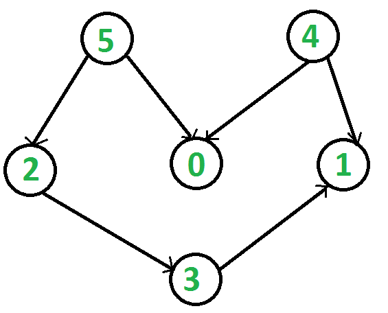

# 拓扑排序

> 翻译自GeeksforGeeks的文章[Topological Sorting](https://www.geeksforgeeks.org/topological-sorting/)

拓扑排序是有向无环图（DAG）的一种访问方式，参照图中边的走向将所有节点线性排列。例如对于一条u到v的有向边，那么线性排列中u一定排列在v的前面。如果不是有向无环图，那么拓扑排序是无法完成的。

<font color=blue>
在EDA中用户设计生成的网表都是有向图，但可能存在环路。
其实有向有环图也可以进行拓扑排序，但需要有统一的破环（break loop）策略。
</font>

以下图为例：



拓扑排序的结果可能有很多种，例如其中一种拓扑排序的结果为`5 4 2 3 1 0`。只要符合前面提到的节点前后位置限制，都是正确的。例如另一个结果`4 5 2 3 1 0`。当然，拓扑排序的第一个节点一定是入度为0的节点（即没有指向该节点的边）。

## 拓扑排序与深度优先搜索（DFS）的对比

在图的DFS中，对于某个节点，需要先访问该节点再递归地访问其相邻的节点。在拓扑排序中，需要先访问该节点再访问其相邻节点。以前面的图为例，拓扑排序中节点5一定要排在节点0前面；与DFS不同的是，节点4也应该排在节点0的前面。这一点是拓扑排序和DFS最重要的差异。例如，DFS的一种可能的结果`5 2 3 1 0 4`并不符合拓扑排序的性质。

[Recommended: Please solve it on “PRACTICE” first, before moving on to the solution.](https://practice.geeksforgeeks.org/problems/topological-sort/1)

## 拓扑排序算法

在DFS算法的基础上进行修改，就可以实现拓扑排序。核心是借助一个栈，访问的某一节点时并不立即输出，而是采用相同的策略递归地访问其相邻的节点，相邻的节点都访问结束后，该节点入栈。当图中所有的节点都访问完毕，此时栈中已经包含了所有的节点，按照出栈的顺序打印节点，就是一种拓扑排序的结果。

下图展示了拓扑排序的过程：


拓扑排序的C++实现（英文原文中有C++/Java/Python/C#四种实现，这里仅摘录C++）：
```cpp
// A C++ program to print topological
// sorting of a DAG
#include <iostream>
#include <list>
#include <stack>
using namespace std;
 
// Class to represent a graph
class Graph {
    // No. of vertices'
    int V;
 
    // Pointer to an array containing adjacency listsList
    list<int>* adj;
 
    // A function used by topologicalSort
    void topologicalSortUtil(int v, bool visited[],
                             stack<int>& Stack);
 
public:
    // Constructor
    Graph(int V);
 
    // function to add an edge to graph
    void addEdge(int v, int w);
 
    // prints a Topological Sort of
    // the complete graph
    void topologicalSort();
};
 
Graph::Graph(int V)
{
    this->V = V;
    adj = new list<int>[V];
}
 
void Graph::addEdge(int v, int w)
{
    // Add w to v’s list.
    adj[v].push_back(w);
}
 
// A recursive function used by topologicalSort
void Graph::topologicalSortUtil(int v, bool visited[],
                                stack<int>& Stack)
{
    // Mark the current node as visited.
    visited[v] = true;
 
    // Recur for all the vertices
    // adjacent to this vertex
    list<int>::iterator i;
    for (i = adj[v].begin(); i != adj[v].end(); ++i)
        if (!visited[*i])
            topologicalSortUtil(*i, visited, Stack);
 
    // Push current vertex to stack
    // which stores result
    Stack.push(v);
}
 
// The function to do Topological Sort.
// It uses recursive topologicalSortUtil()
void Graph::topologicalSort()
{
    stack<int> Stack;
 
    // Mark all the vertices as not visited
    bool* visited = new bool[V];
    for (int i = 0; i < V; i++)
        visited[i] = false;
 
    // Call the recursive helper function
    // to store Topological
    // Sort starting from all
    // vertices one by one
    //for (int i = 0; i < V; i++)
    for (int i = V - 1; i >= 0; --i)
        if (visited[i] == false)
            topologicalSortUtil(i, visited, Stack);
 
    // Print contents of stack
    while (Stack.empty() == false) {
        cout << Stack.top() << " ";
        Stack.pop();
    }
}
 
// Driver Code
int main()
{
    // Create a graph given in the above diagram
    Graph g(6);
    g.addEdge(5, 2);
    g.addEdge(5, 0);
    g.addEdge(4, 0);
    g.addEdge(4, 1);
    g.addEdge(2, 3);
    g.addEdge(3, 1);
 
    cout << "Following is a Topological Sort of the given "
            "graph \n";
 
    // Function Call
    g.topologicalSort();
 
    return 0;
}
```
程序的运行结果如下：
```bash
Following is a Topological Sort of the given graph
4 5 0 2 3 1
```
算法复杂度分析：
- 时间复杂度：`O(V+E)` 以DFS为基础框架，外用了一个栈，时间复杂度和DFS相同。
- 空间复杂度：`O(V)` 用来判断节点是否访问过和辅助的栈大小都是V。

**注意：**也可以使用`vector`来替换栈，将vector反向输出即可。

## 拓扑排序的应用
在互相之间具有相关性的任务中，进行任务调度是拓扑排序的主要应用场景。在计算机科学中，这种类型的应用出现在：指令调度、在电子表格中重新计算公式值时的公式单元格评估的顺序（没怎么懂）、**逻辑综合**、在make file中确定文件的编译顺序、数据序列化、以及链接器解析符号的依赖。

## 相关文章
- [Kahn's algorithm for Topological Sorting](https://www.geeksforgeeks.org/topological-sorting-indegree-based-solution/)：另一个时间复杂度为`O(V+E)`的算法
- [All Topological Sorts of a Directed Acyclic Graph](https://www.geeksforgeeks.org/all-topological-sorts-of-a-directed-acyclic-graph/)

## 参考文章
- [http://www.personal.kent.edu/~rmuhamma/Algorithms/MyAlgorithms/GraphAlgor/topoSort.htm](http://www.personal.kent.edu/~rmuhamma/Algorithms/MyAlgorithms/GraphAlgor/topoSort.htm)
- [http://en.wikipedia.org/wiki/Topological_sorting](http://en.wikipedia.org/wiki/Topological_sorting)
