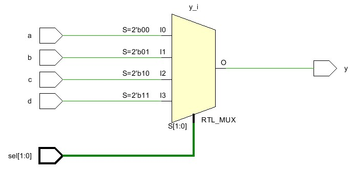
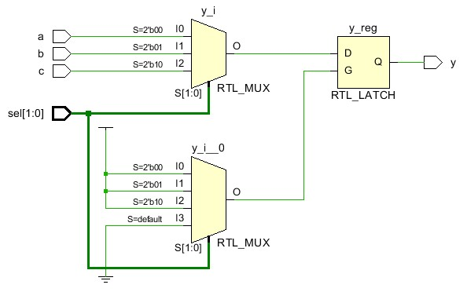
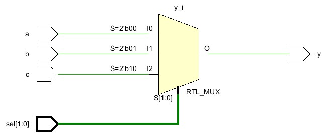

# Verilog中的*full_case*

一般情况下，在verilog中使用case语句都会把每种条件的结果都写全；即使没有列出所有情况也需要加default来添加默认情况。

对于已经罗列出所有情况的case语句，综合器在综合时会将其视为一种多选一的多路选择器（MUX），并将其转换为组合逻辑。例如：

```verilog
always @(a or b or c or d or sel) begin
  case (sel)
  2'b00: y = a;
  2'b01: y = b;
  2'b10: y = c;
  2'b11: y = d;
  endcase
end
```

会被视为一个四选一多路选择器（4-MUX），通过组合逻辑就可以实现。



后续的逻辑综合中，对于Xilinx v7的器件，一个LUT6即可实现设计的功能。

如果没有`11`这种情况，并且没有添加default，出现了没有列出的情况：

```verilog
always @(a or b or c or sel) begin
  case (sel)
  2'b00: y = a;
  2'b01: y = b;
  2'b10: y = c;
  endcase
end
```

此时综合器会默认`11`这种没列出的情况会令`y`保持原值，从而产生一个latch。



如图所示，通常`always`后的敏感列表中的信号会被推导成latch的G（时钟信号）。在后续的逻辑综合中，由于latch的存在，额外还需要两个LUT，其输出分别作为latch的D和G端口的输入。

如果设计的本意是只存在`a`、`b`和`c`这三种情况的话，很明显保持原值的功能是没有必要的。此时就需要`full_case`来告知综合器，当前已经罗列了所有情况。综合结果如下图所示：



和最开始罗列了四种情况的综合结果一致。

这就是`full_case`的作用，告知综合器当前罗列的情况已经是全部情况，其他情况不需要考虑。以上的Schematic图均来自Vivado2018。

综合器要如何实现`full_case`的功能？我的想法是通过搭建组合逻辑的方式，将case的功能通过组合逻辑实现，即使存在冗余逻辑，通过后续的逻辑综合给优化掉。

当然也只是提供了一个思路，*sifei*提供的思路更复杂，不知道*ailing*同学最后是怎么实现的。

## 参考文章
1. [full_case parallel_case学习心得](https://www.cnblogs.com/aikimi7/p/3352365.html)
2. [Verilog中的full_case和parallel_case](https://blog.csdn.net/qushuo123/article/details/108804889)
