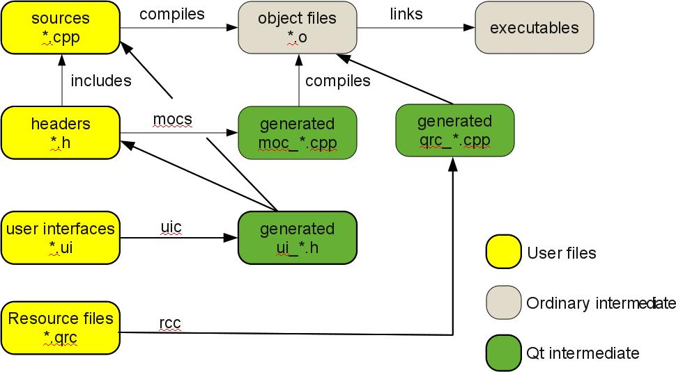

# 从C++到Qt

一篇很早的文章，[原文链接](http://blog.debao.me/zh/2010/11/from-cpp-to-qt/)

毕业后第一份工作的工作内容就是Qt，不得不说Qt提供了太多API，上手门槛很低，同时也会导致学到的东西不多。还是希望能够尽可能多地了解一些原理上的东西，因此这个Qt的系列会记录一些相关的文章。

> 本文舍弃IDE或qmake、cmake等工具的束缚，尝试通过几个例子，一步一步从标准 C++ 的编译过渡到 Qt 的编译。

> 本文涉及的都是最基本的东西，或许可以说，只要你用C++ Qt，不管是通过哪种工具(qmake、cmake、boost.build、qtcreator、vs2008、Eclipse、...)，本文的内容都是需要理解的(尽管真正写程序时，我们都不会直接用C++编译器来编译Qt程序)。

原文使用的是Qt4，在最后也简单更新了针对Qt5的一些改动；本文中均改成了Qt5（如今Qt6也已经出来了）。Qt版本为Qt5.8.0，环境为Windows10，通过安装mingw来调用g++命令。

## 例子一：简单的控制台程序

某种程度来说，本文讲解了g++工具的使用。用到的配置选项：

- `-o` 指定生成的文件名称
- `-I` 指定头文件的路径
- `-L` 指定库文件的路径
- `-D` 指定必要的宏
- `-l` 指定需要链接的库

g++在使用时最常接触的选项就是`-o`，编译一个简单的小程序时就会用到。除此之外还有：

- `-g` 调试选项，编译后的可执行文件带有调试信息，可使用gdb调试
- `-c` 编译和汇编选项，但不进行链接
- `-S` 编译选项，不进行汇编和链接，生成的main.s是程序的汇编结果
- `-E` 仅进行预处理，不进行编译；如果要保留注释，可以添加`-C`

言归正传，源程序test.cpp：
```cpp
#include <QtCore/QCoreApplication>
#include <QtCore/QDebug>

int main(int argc, char** argv) {
  QCoreApplication app(argc, argv);
  qDebug() << "hello qt!";
  app.exec();
}
```
从该程序中可以看到，要想能够正常编译和运行，在编译器需要提供QtCore相关的头文件、以及相应的实现库，并在运行时需要链接库文件。

编译命令如下：
```shell
g++ test.cpp -o test -DQT_CORE_LIB -IC:/Qt/Qt5.8.0/5.8/mingw53_32/include -LC:/Qt/Qt5.8.0/5.8/mingw53_32/lib -lQt5Core -std=c++11
```

在编译命令中，`-std=c++11`是在第一次编译失败的信息中提出需要额外添加的，应该和Qt5相关。

如果在test的路径下直接运行，大概率会报出找不到Qt5Core运行库的问题。此时，将Qt安装目录下的Qt5Core.dll复制到test路径下即可。

## 例子二：简单的GUI程序

这次稍微复杂一点，不是单一的控制台程序，而是一个简单的GUI程序。稍微修改了一下代码，移除了原文中的widget.cpp。

main.cpp
```cpp
#include <QtWidgets/QApplication>
#include "widget.h"

int main(int argc, char** argv) {
  QApplication app(argc, argv);
  Widget w;
  w.show();
  return app.exec();
}
```

widget.h
```cpp
#include <QtWidgets/QWidget>
class Widget : public QWidget {
  public:
    Widget(QWidget * parent = NULL) : QWidget(parent) {}
};
```

> 同样，这个程序未使用Qt的扩展，直接用C++编译器编译：

```shell
g++ main.cpp -DQT_CORE_LIB -DQT_WIDGETS_LIB -Ic:\Qt\Qt5.8.0\5.8\mingw53_32\include -o main -Lc:\Qt\Qt5.8.0\5.8\mingw53_32\lib -lQt5Core -lQt5Widgets -std=c++11
```
运行时同样需要补充dll库文件。因为使用了QWidget模块，所以和前面相比：
- 增加了宏`-DQT_WIDGETS_LIB`和链接库`-lQt5Widgets`

> 在Windows下，分为console和windows两个链接子系统，而且入口函数分为main和WinMain。

上一条命令编译会弹出控制台，通过`man g++`查看手册，可以看到选项`-mwindows`可以实现对windows子系统的链接，加上该选项之后就不会再弹出控制台。（原文中提到的选项似乎已经不支持）

### 多文件的程序如何管理

其实就是项目工程的管理，一个项目的开发肯定需要多人合作，源文件也不会只有一个。手写g++编译命令的问题：
> - 编译时参数多、要链接的库各种各样，命令很长
> - 每次只要修改一个文件，所有东西都要重新编译

这里简单贴出mingw32-make的Makefile文件：
```shell
CPPFLAGS = -DQT_CORE_LIB -Ic:\Qt\Qt5.8.0\5.8\mingw53_32\include -std=c++11
LDFLAGS = -Lc:\Qt\Qt5.8.0\5.8\mingw53_32\lib -lQt5Core -lQt5Widgets

objects = main.o
dest = main
$(dest) : $(objects)
	g++ -o $@ $(objects) $(LDFLAGS) -std=c++11
```
> 对此不做介绍，因为Makefile编写也是一门学问。相当难写，所有才有qmake、cmake这些工具来帮我们生成Makefile文件。

我司的EDA工程项目通过qmake来管理整个工程的编译，整个工程由各个子工程组成，分别实现不同的功能。修改子工程后仅需编译这部分，不会影响其他功能（有依赖的情况除外）。

## 例子三：引入moc

> Qt对C++的扩展主要时三个方面：
> - 元对象系统：包含`Q_OBJECT`宏的文件（.h，.cpp等）需要moc预处理
> - 资源系统：.qrc文件需要rcc进行预处理
> - 界面系统：.ui文件需要uic进行预处理
> 这三者之中，元对象系统最复杂，也是Qt程序中最重要的。

在例子二源码的基础上，在Widget类中加入宏`Q_OBJECT`：

来自g++的问候：
```
C:\Users\FMSH-D~1\AppData\Local\Temp\ccaq6Egc.o:main.cpp:(.text$_ZN6WidgetC1EP7QWidget[__ZN6WidgetC1EP7QWidget]+0x3a): undefined reference to `vtable for Widget'
C:\Users\FMSH-D~1\AppData\Local\Temp\ccaq6Egc.o:main.cpp:(.text$_ZN6WidgetC1EP7QWidget[__ZN6WidgetC1EP7QWidget]+0x44): undefined reference to `vtable for Widget'
C:\Users\FMSH-D~1\AppData\Local\Temp\ccaq6Egc.o:main.cpp:(.text$_ZN6WidgetD1Ev[__ZN6WidgetD1Ev]+0xa): undefined reference to `vtable for Widget'
C:\Users\FMSH-D~1\AppData\Local\Temp\ccaq6Egc.o:main.cpp:(.text$_ZN6WidgetD1Ev[__ZN6WidgetD1Ev]+0x14): undefined reference to `vtable for Widget'
collect2.exe: error: ld returned 1 exit status
```

未定义的引用，也即在VS中的常见链接错误error LNK2001：无法解析的外部符号。该错误提示：存在只有声明而未定义的对象、方法被引用。比较常见的原因是，编译时源文件缺失、链接库缺失。

展开宏`Q_OBJECT`，命令如下：
```shell
g++ -E main.cpp -DQT_CORE_LIB -DQT_WIDGETS_LIB -Ic:\Qt\Qt5.8.0\5.8\mingw53_32\include -o main.log -std=c++11
```

部分结果如下（为了防止单行过长加了一些换行）：
```cpp
# 2 "c:\\Qt\\Qt5.8.0\\5.8\\mingw53_32\\include/QtWidgets/QWidget" 2
# 2 "widget.h" 2
class Widget : public QWidget {
  public: template <typename ThisObject> inline void qt_check_for_QOBJECT_macro(const ThisObject &_q_argument) const { 
            int i = qYouForgotTheQ_OBJECT_Macro(this, &_q_argument); i = i + 1;
          }
# 3 "widget.h"
#pragma GCC diagnostic push
# 3 "widget.h"
 
# 3 "widget.h"
#pragma GCC diagnostic ignored "-Wsuggest-override"
# 3 "widget.h"
  static const QMetaObject staticMetaObject;
  virtual const QMetaObject *metaObject() const; 
  virtual void *qt_metacast(const char *); 
  virtual int qt_metacall(QMetaObject::Call, int, void **); 
  static inline QString tr(const char *s, const char *c = nullptr, int n = -1) { return staticMetaObject.tr(s, c, n); } 
  static inline QString trUtf8(const char *s, const char *c = nullptr, int n = -1) { return staticMetaObject.tr(s, c, n); } 
  private: 
  static void qt_static_metacall(QObject *, QMetaObject::Call, int, void **);
# 3 "widget.h"
#pragma GCC diagnostic pop
# 3 "widget.h"
  struct QPrivateSignal {};
  public:
    Widget(QWidget * parent = 
# 5 "widget.h" 3 4
                             __null
# 5 "widget.h"
                                 ) : QWidget(parent) {}
};
```

可以看到，展开后的`Q_OBJECT`为`Widget`类添加了很多函数的声明。如果要正确编译，需要获取这些函数的定义并添加到编译过程中。生成函数的定义，正是moc所做的（moc为Meta-Object Compiler的缩写，即元对象编译器）：
```shell
moc widget.h -o moc_widget.cpp
```
添加moc_widget.cpp后，编译恢复正常。Windows下moc的可执行文件位于Qt安装目录下的bin目录中。

至于rcc和uic，与moc类似，将各自编译的结果该文件添加到编译过程中，就相当于将资源（如图片、图标等）和界面设计（通过Qt Designer定制的界面）引入到应用程序中。
- rcc将资源文件编译成.cpp的源文件，通常会比较大；
- uic将界面文件编译成.h头文件，设计的自由度高的程度高；Qt Designer也可以在设计界面的同时加入简单的信号槽功能（如针对`QDialog`的`accept()`和`reject()`）。

在程序中使用各自的对象时都有特定的调用格式，具体的内容可查看Qt的官方文档。不得不说rcc和uic的扩展让Qt的上手难度变低了很多。

## 总结

这里先贴一下原文的最后一张图：（的确经过文章的讲解，这个图也更好理解了😀）



其实本文中设计比较多的是编译相关的知识，尤其是对于`g++`的使用，能够熟练使用相应的选项得到正确的编译结果；其次才是Qt的一些知识，Qt的确是对C++进行了扩展，其中的元对象系统（Meta-Object System）也是Qt的一个重要的部分，本文并没有过多地深入，后续的文章将会继续探索相关的内容。

## 参考文章
1. [从C++到Qt](http://blog.debao.me/zh/2010/11/from-cpp-to-qt/)
2. [gcc宏展开](https://blog.csdn.net/tofro/article/details/7495279)
