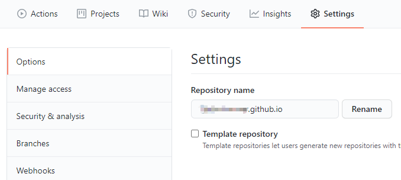
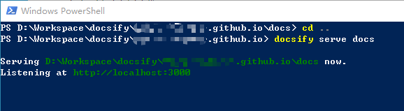
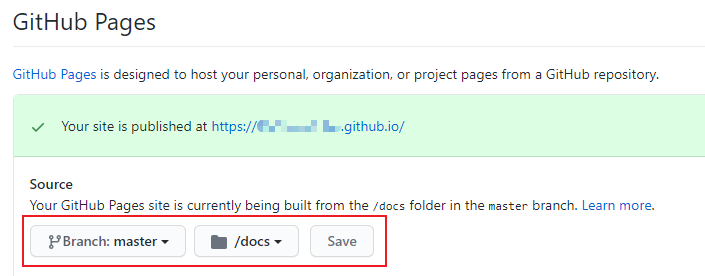
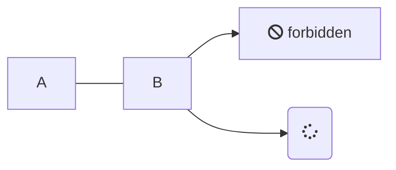

# 使用docsify搭建博客

## 前言

这应该是第三次在Github Pages上搭建博客，前两次分别用的`jekyll`和`hexo+Next`。从复杂度上来说，`jekyll` < `hexo+Next`，但同步起来都不方便，一旦换电脑就很麻烦。这次偶然从知乎上看到的`docsify`的方案，试了一下的确很方便，显示效果也符合我的要求，一点也不花里胡哨。

下面将简单记录一下搭建的过程及中间遇到的问题，主要参考[这一篇文章](https://www.cnblogs.com/happyone/p/12152566.html)。话说这次操作方便了，能养成记录博客的习惯吗？/(ㄒoㄒ)/~~

首先说明，这次是在Win10上进行的操作。

## Github上的准备

新建仓库，直接在Github网页端完成。如果想直接通过`https://username.github.io`访问的话，新仓库要命名为`username.github.io`。当然，创建后名称也可以改，问题不大。



## 连接git和Github

到`git`的[官网](https://git-scm.com/download/win)下载对应的版本并安装。

连接git到Github，网上教程很多，不在此详述。[这是一个教程](https://www.cnblogs.com/flora5/p/7152556.html)，核心操作：生成ssh的key，在Github的settings中读入。

**更新**：新版的git连接github可以不用生成ssh的key，在git的bash中配置了邮箱和用户名之后，进行`git commit`等操作时，会提示读取浏览器的cookies状态，来进行连接。

选择一个工作目录，直接通过`clone`的方式，将之前新建的仓库同步到本地：

```bash
git clone https://github.com/username/username.github.io
```

## 安装docsify

应该需要`node.js`的环境，直接去[官网](http://nodejs.cn/download/)下载安装对应的版本。

然后安装`docsify`，在Win10的Terminal/PowerShell中执行：

``` bash
npm i docsify-cli -g
```

## 初始化docsify到仓库中

在`clone`下的仓库目录中，执行`docsify`的初始化：

``` bash
docsify init ./docs
```

这里可能会遇到**此系统上禁止运行脚本**的问题，这是PowerShell执行策略默认设置为`Restricted`的原因，需要使用**管理员权限**修改。详细内容可以[参考这里](https://www.jianshu.com/p/4eaad2163567)，在PowerShell中执行：

``` bash
set-executionpolicy remotesigned
```

执行`docsify init ./docs`之后，将生成`docs`文件夹，内部包含几个文件：
- .nojekyll    用于阻止Github Pages忽略掉下划线开头的文件
- index.html   文件入口，可以修改其中的配置进行定制
- README.md    默认的主页

以下划线开头的文件多是`docsify`的配置文件，如侧边栏`_sidebar.md`，后续进行定制时可以进行添加。

通过启动服务来进行预览：

``` bash
docsify serve docs
```



访问对应的链接`http://localhost:3000`，即可看到预览效果。

暂时不配置其他内容，将这些文件`push`到Github的仓库中：

``` bash
git add -A
git commit -m "myblogs first commit"
git push -u origin master
```

## 配置Github Pages

成功提交到Github仓库之后，进行Github Pages的配置：



直接访问`https://username.github.io`即可，和预览的效果一致。

如果需要定制相应的功能的话，直接去参照`docsify`的[官方文档](https://docsify.js.org/)进行功能添加、修改即可。有中文版，很方便。

PS：总体来说图片码了个寂寞😂

## ~~遇到的一些坑~~ 新增的一些功能

### 1. C++代码高亮

根据`docsify`的[官方文档](https://docsify.js.org/)，在markdown中进行代码高亮时需要添加对应的
[Prism仓库](https://github.com/PrismJS/prism/tree/gh-pages/components)中的js文件。

然而，C++语法高亮需要添加以下三个：
```html
<script src="//unpkg.com/prismjs/components/prism-c.js"></script>
<script src="//unpkg.com/prismjs/components/prism-clike.js"></script>
<script src="//unpkg.com/prismjs/components/prism-cpp.js"></script> 
```

仅仅添加prism-cpp.js是不够的。参考自[该文章](https://www.wenjinyu.me/zh/docsify-make-a-notebook-application-of-your-own/)的代码高亮一节。
这篇文章中提到的一些`docsify`的配置还是很有用的。

### 2. 其他主题

其实主题修改方面个人觉得意义不大，但以后可能修改，因此也要做一些功课。

目前已知的修改主题方式可参考[该文章](https://jhildenbiddle.github.io/docsify-themeable/#/introduction)，使用`docsify-themeable`，自由定制化程度较高。

简单试过修改为暗黑模式，效果还可以，~~但还是换回了原来的主题，因此不再赘述~~。
更新：最终选择了simple主题。

### 3. latex公式支持

最开始使用katex的方式，不知道什么时候开始完全没效果。最后经过搜索，使用MathJax的方式。

参见[docsify-latex with mathjax](https://scruel.github.io/docsify-latex/#/?id=with-mathjax)；
在`index.html`中额外添加：
```html
<script src="//cdn.jsdelivr.net/npm/mathjax@3/es5/tex-mml-chtml.js"></script>
<script src="//cdn.jsdelivr.net/npm/docsify-latex@0"></script>
```

### 4. mermaid流程图支持
最近想在博客中增加一些流程图，想起了一些markdown编辑器是支持mermaid来进行画图的。

于是找了一下让docsify支持mermaid的方法，参考[mermaid-docsify](https://codeberg.org/3rd/mermaid-docsify/src/branch/master/README.md)，
在`index.html`中额外添加：
```html
<script src="//unpkg.com/mermaid/dist/mermaid.js"></script>
<script src="//unpkg.com/docsify-mermaid@latest/dist/docsify-mermaid.js"></script>
<script>mermaid.initialize({ startOnLoad: true  });</script>
```
用于测试的markdown代码，以及现实效果如下：
````markdown

````

插入以上代码的时候遇到一个问题，即怎么在代码块中输入<code>`</code>（反引号）。

经过搜索发现，原来<code>`</code>控制代码块的开始和结束并不需要都是三个，只需要前后匹配即可，几个都可以，学到了。
参见参考文章[9]。

### 5. 增加切换主题的按钮
想要让博客自动切换主题，最好是随着时间变化，到晚上就切换夜间模式；想换主题也不用再改代码。

搜了一下自动切换好像比较麻烦，但可以给博客加一个切换夜间模式的按钮，感觉也不错。
添加方法如下，具体见参考文章[10]：
```html
<!-- head -->
<!-- 给 theme stylesheet 设置对应的 title，可以设置多个  -->
<link rel="stylesheet" title="light" href="//cdn.jsdelivr.net/npm/docsify/themes/vue.css">
<link rel="stylesheet" title="dark" href="//cdn.jsdelivr.net/npm/docsify/themes/dark.css">

<!-- 引用 docsify-dark-switch.css  -->
<link rel="stylesheet" href="//cdn.jsdelivr.net/npm/docsify-dark-switch/dist/docsify-dark-switch.css">

<!-- Also insert you custom css -->

<!-- body -->
<!-- 引用 docsify-dark-switch.js 或 docsify-dark-switch.min.js  -->
<script src="//cdn.jsdelivr.net/npm/docsify-dark-switch/dist/docsify-dark-switch.min.js"></script>
```

## 参考文章
1. [Git基础-获取Git仓库](https://www.git-scm.com/book/zh/v2/Git-基础-获取-Git-仓库#ch02-git-basics-chapter)
2. [Git与Github的连接和使用](https://www.cnblogs.com/flora5/p/7152556.html)
3. [PowerShell因为在此系统上禁止运行脚本解决方法](https://www.jianshu.com/p/4eaad2163567)
4. [基于Github Pages + docsify半天搭建个人博客](https://www.cnblogs.com/happyone/p/12152566.html)
5. [温锦瑜的博客 docsify：做一个自己的笔记本应用](https://www.wenjinyu.me/zh/docsify-make-a-notebook-application-of-your-own/)
6. [docsify-themeable](https://jhildenbiddle.github.io/docsify-themeable/#/introduction) 
7. ~~[docsify-latex](https://scruel.github.io/docsify-latex)~~
[docsify-latex with mathjax](https://scruel.github.io/docsify-latex/#/?id=with-mathjax)
8. [mermaid-docsify](https://codeberg.org/3rd/mermaid-docsify/src/branch/master/README.md)
9. [Markdown 如何在内联代码或者代码块中使用代码开始符号反引号（\`）](https://cloud.tencent.com/developer/article/2348842)
10. [手写一个 docsify 切换主题 plugin](https://jishuzhan.net/article/1755065390297255937)
