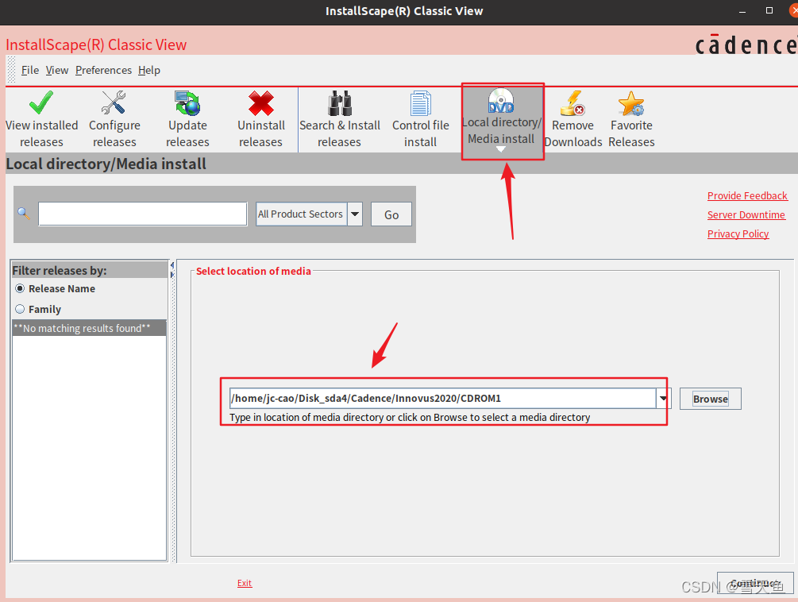
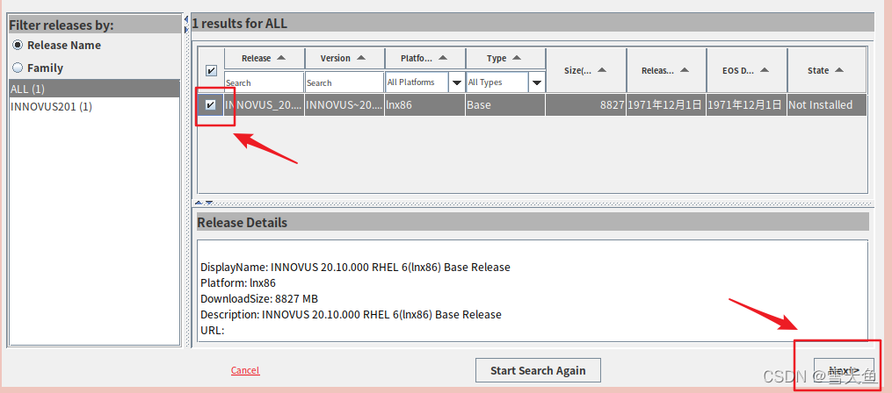
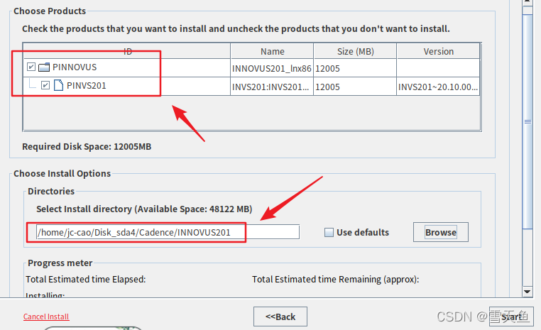
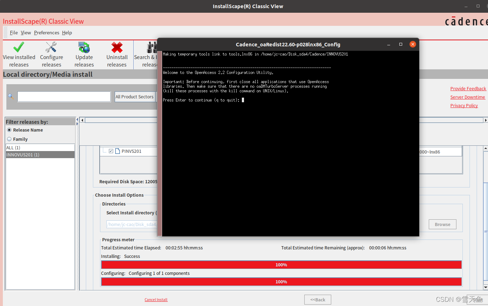
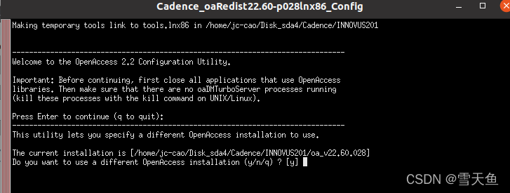
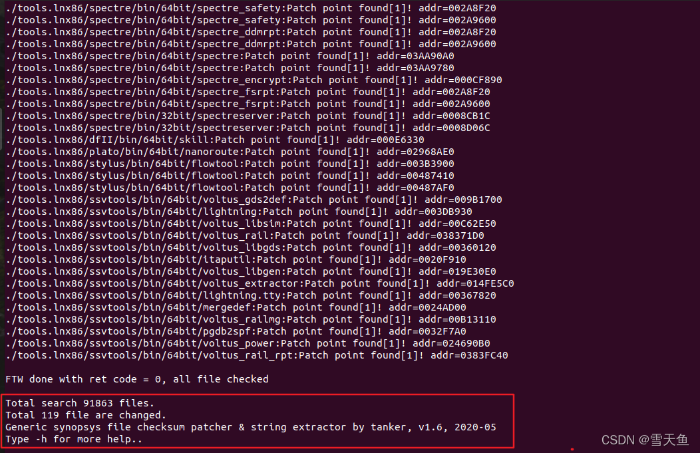

# EDA软件安装记录：Cadence Innovus 2020
## 写在前面
Innovus是数字后端设计比较常用的软件，是国外EDA软件三巨头Cadence的软件。Synopsys与之对应的软件是ICC2，效果上差别不大，功能上可以说各有所长。关于Innovus和ICC2之间，其实还有一段往事，感兴趣的可以去了解下；我也写了相关的读后感。

## 参考文章
1. [Cadence Innovus2020 在Ubuntu20.04上的安装教程【超详细】](https://blog.csdn.net/qq_44447544/article/details/122698979)
2. [Ubuntu22安装IC618、spectre21、innovus211、calibre2022](https://zhuanlan.zhihu.com/p/659144314)

第一篇提供了安装过程中的截图，但破解部分没啥用；第二篇破解部分比较详细，且提供了软件安装包，破解软件和详细的方法。

建议主要参考第二篇；第二篇虽然内容是INNOVUS211，但提供的安装包似乎是INNOVUS201，不过安装上没什么差别。

## 系统环境
系统：Ubuntu20.04

软件：INNOVUS201(20.10)

## 安装步骤

### 0.安装依赖
Innovus安装程序是基于java的，需要安装jdk等一些依赖，命令如下：
```bash
sudo apt install openjdk-11-jdk
sudo apt install ksh csh xterm
sudo add-apt-repository ppa:linuxuprising/libpng12
sudo apt install libpng12-0
sudo apt install libjpeg62
sudo apt install libncurses5
```
可以加上`-y`直接跳过命令运行后的询问是否安装。
> Cadence家的脚本默认使用ksh而不是bash。

对于破解软件，还需要安装lsb的依赖（lmgrd运行会用到），这个也可以等到安装后破解之前安装。命令如下：
```bash
sudo apt install lsb-core lsb-base
```

### 1.下载软件和解压
见上文参考文章2中的百度网盘。下载原始的安装包后，会发现有三个`.tar`文件：
- `Base_INNOVUS20.10.000_lnx86_1of3.tar`
- `Base_INNOVUS20.10.000_lnx86_2of3.tar`
- `Base_INNOVUS20.10.000_lnx86_3of3.tar`

!> 这三个压缩包并不是解压一个就都解压（并不是分卷压缩），而是需要逐个解压。

使用命令`tar xvf XXX.tar`，完成后会生成`INNOVUS20.10.000_lnx86.Base`文件夹。

对压缩文件`INNOVUS20.10.000_lnx86.Base/CDROM1/IScape04.23-s012lnx86.t.Z`这个文件进行解压（里面是安装程序）：
```bash
gunzip IScape04.23-s012lnx86.t.Z
tar xvf IScape04.23-s012lnx86.t
```
解压缩后会生成文件夹`iscape04.23-s012`和对应的软连接文件`iscape`。

### 2.启动安装程序
进入到`iscape/bin`路径下，直接运行`./setup.sh`脚本，启动安装程序。

?> 以下图片截取自前文提到的参考文章1。

选择`Local directory/Media Install`并且指定之前解压后的完整安装包路径，到`CDROM1`这一级。



点击Continue。

?> 这里可能出现的问题是点击Continue后安装程序提示`No such file or directory`。
我遇到这个情况的原因是解压原始安装包不完全，以为是分卷压缩只解压了第一个，导致安装程序文件不完整。

选中搜索结果中的`INNOVUS20.10.000_lnx86`，点击Next。



勾选PINNOVUS，设置Innovus的目标安装路径。



点击Start开始安装，需要等待一段时间安装结束。

安装完成后会进行Configure，碰到license相关的内容直接选No即可。（实际上我并没有遇到）



第一个选择Enter直接继续，OpenAccess相关的内容也直接选No。



最后提示安装完毕，手动退出安装程序。


至此安装结束，先不用启动软件，完成破解后再启动。

### 3.破解
安装完成后使用1patch工具进行破解。总结下来有以下几步：
1. 通过1patch替换安装路径下的Innovus文件；
2. 修改license文件，指定本机的hostname和hostid；
3. 修改.bashrc文件，增加Innovus相关的环境变量；
4. 启动lmgrd系统服务，即license server让Innovus处于被激活的状态。

?> 1patch软件和license文件，在前文参考文章2中的百度网盘中都有。

其中1patch软件来自于[创芯网论坛](https://www.eetop.cn)中的[一篇资源共享贴](https://bbs.eetop.cn/thread-896342-1-1.html)，cadence.dat的来源未知。

将`ocad.tar.gz`解压，进入`ocad/bin/`路径下，运行：`1patch -ecc ~/cadence/installs/INNOVUS201`。

其中参数为INNOVUS201的安装路径；运行过程中输出的log类似下图：



?> 有可能会报比较多的`Error! Base block contain too many instructions[4101]`之类的Error信息，暂时未发现影响，忽略即可。

将license文件（cadence.dat）复制到本地目录下（最好是安装目录，方便管理），修改这个文件的第一行：
```bash
SERVER hostname hostid 20030
```
其中hostname通过命令`hostname`获取，hostid通过命令`ifconfig`获取。

?> 从参考文章的意思，hostid就是mac地址，填入删除分隔符`:`之后的12个数字或字母即可。

修改.bashrc文件，设置Innovus相关的环境变量：
```bash
# Cadence Innovus & License
export CADENCE_DIR=/tools/cadence
export INNOVUS_DIR=$CADENCE_DIR/INNOVUS201
export LM_LICENSE_FILE=$CADENCE_DIR/license/cadence.dat
export LD_LIBRARY_PATH=$LD_LIBRARY_PATH:$INNOVUS_DIR/tools.lnx86/lib
export PATH="$PATH:$INNOVUS_DIR/bin"
export PATH="$PATH:$INNOVUS_DIR/tools.lnx86/bin"
export PATH="$PATH:$INNOVUS_DIR/tools.lnx86/dfII/bin"
```

运行`source ~/.bashrc`来刷新环境变量。

启动license server，令Innovus处于激活状态：
```bash
/tools/cadence/ocad/tools/licsrv/bin/bin.cds/lmgrd -c $LM_LICENSE_FILE
```

运行命令后会显示license server的启动信息，稍等几秒钟后回车，在终端启动`$INNOVUS_DIR/bin/innovus`。

?> lmgrd如果无法运行，一直显示No such file or directory，有可能是lsb-core/lsb-base的依赖未安装导致。

如果可以正常显示Innovus的gui，即破解成功。

为了方便以后运行程序，以及必要时启动license server，可以给.bashrc中添加别名：
```bash
alias innovus=$INNOVUS201/bin/innovus
alias cds_lmgrd='/tools/cadence/ocad/tools/licsrv/bin/bin.cds/lmgrd -c $LM_LICENSE_FILE'
```

## 遗留问题修复
如果完成上述的步骤之后，Innovus未成功启动，或者启动后存在一些奇怪的Warnings，以下记录其中一部分的修复方法。

### libXp.so.6库文件缺失
此时无法正常启动innovus，报错为：`error while loading shared libraries: libXp.so.6: cannot open shared object file: no such file or directory`

原因为缺少libXp.so.6这个库文件，在[官网](http://ftp.xfree86.org/pub/XFree86/4.8.0/binaries/Linux-x86_64-glibc23/)下载补上即可。
```bash
wget http://ftp.xfree86.org/pub/XFree86/4.8.0/binaries/Linux-x86_64-glibc23/Xbin.tgz
tar xvf Xbin.tgz
sudo cp Xbin/lib64/libXp.so.6 /usr/lib/
sudo chmod 777 /usr/lib/libXp.so.6
```

再次执行后该错误消失。

### 未完待续

## 其他参考文章
1. [最全面解决：lmgrd出现no such file and directory问题方法](https://blog.csdn.net/weixin_44833870/article/details/139279167)
2. [linux查询主机名和主机ID](https://blog.csdn.net/baidu_39442520/article/details/120720001)
