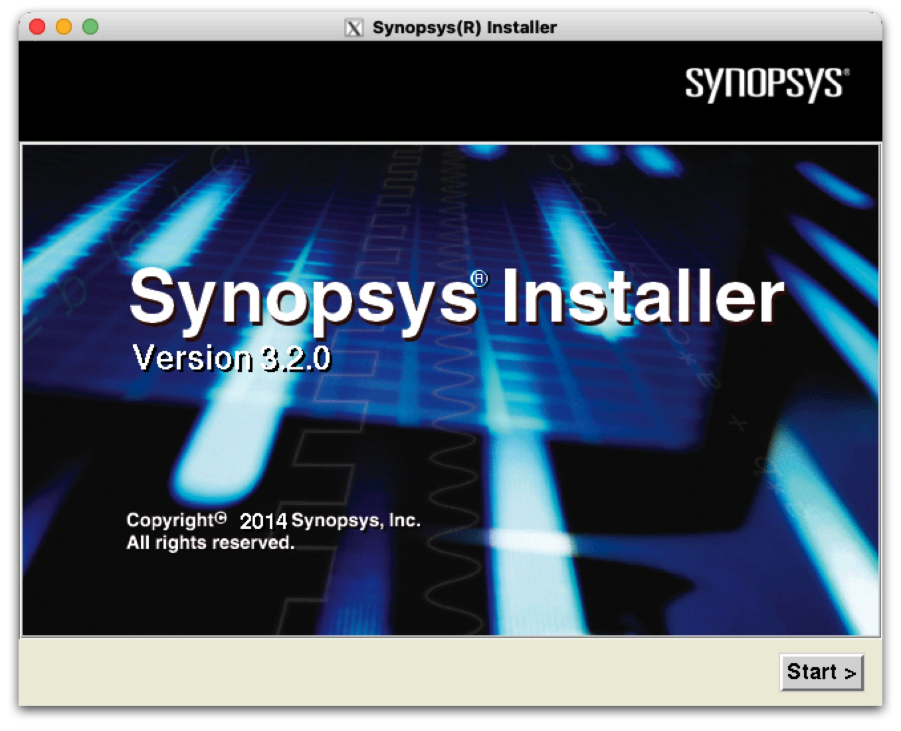

# EDA软件安装记录：Synopsys PrimeTime 2016

## 写在前面
本来已经在Mac mini 2012 late上额外装了Win10和Ubuntu20.04两个系统，希望在Ubuntu上安装Synopsys软件。然而Ubuntu所在的固态硬盘直接坏掉，之前折腾的东西相当于全都白费。重新买了一块固态硬盘、重装系统后，觉得太折腾一度搁置了。

后来咨询了下deepseek，发现可以在Macbook Air M1上，基于OrbStack里面的intel版本的Ubuntu系统进行安装。难点在于OrbStack原本不支持GUI应用，需要利用X11进行转发，这部分deepseek给出的方案还算靠谱。本文是安装过程的记录。

## 参考文章
1. [Synopsys EDA Tools安装](https://zhuanlan.zhihu.com/p/564884836)
2. [Synopsys EDA Tools安装和使用过程中出现的问题及解决方法](https://zhuanlan.zhihu.com/p/433125915)
3. [关于Synopsys的“design compiler is not enabled”问题](https://zhuanlan.zhihu.com/p/143064609)
4. [(snpslmd) TCP_NODELAY NOT enabled](https://bbs.eetop.cn/thread-871282-1-1.html)
5. [解决Error opening terminal: xterm-256color](https://www.codeleading.com/article/25613021506/)

## 系统环境
硬件：Macbook Air M1（8G + 256G）

系统：macOS Tahoe 26.3 + OrbStack 2.0.5 + Ubuntu20.04 amd64

软件：PrimeTime2016

## 安装步骤
### 0.系统准备
在macOS的安装OrbStack、创建amd64版本的Ubuntu容器，GUI操作即可，这里不再赘述。

比较重要的是让OrbStack能支持GUI显示，以下是经过验证的deepseek给出的配置方案：

✅ Ubuntu x86 + X11 转发的标准操作（已验证100%可通）

#### 📦 第1步：确认你有一个 Ubuntu x86 虚拟机

```bash
# 查看现有虚拟机
orb list

# 如果没有，立刻创建一个（--arch amd64 是关键）
orb create --arch amd64 ubuntu:22.04 ubuntu-x86
orb -m ubuntu-x86 bash
```

**验证架构**：
```bash
uname -m
# 必须输出 x86_64
```

#### 🖥 第2步：Mac 端安装 XQuartz（这是 90% 失败的原因）

```bash
# Mac 终端执行
brew install --cask xquartz
```

**安装完成后必须操作**：
1. **重启 Mac**（最稳妥），或者至少**注销当前用户重新登录**
2. 从 Launchpad 打开 **XQuartz**（左上角菜单栏会出现 XQuartz 字样）
3. **XQuartz → 设置 → 安全性 → 勾选“允许从网络客户端连接”**

**验证 XQuartz 是否就绪**：
```bash
# Mac 终端
echo $DISPLAY
# 如果输出 :0 或 localhost:0，说明正常
# 如果空行，说明没生效，重启 Mac
```

#### 🔑 第3步：Ubuntu 虚拟机内安装必要组件

```bash
# 在 Ubuntu x86 虚拟机内执行
sudo apt update
sudo apt install -y x11-apps  # 包含 xclock 等测试工具
```

**Ubuntu 不需要装 SSH 服务器！**  
OrbStack 的 Ubuntu 镜像**默认已开启 SSH，端口就是 22**。你不需要改任何配置文件。

#### 🔗 第4步：建立带 X11 转发的 SSH 连接

**关键中的关键**：  
❌ **不要用 Mac 的系统终端（Terminal.app）**  
✅ **必须从 XQuartz 的终端窗口执行 SSH**

**正确操作**：
1. 点击 Mac 左上角菜单栏的 XQuartz 图标
2. 选择 **Applications → Terminal**
3. 在弹出的**白色背景终端**中执行：

```bash
ssh -X your-username@ubuntu-x86.orb.local
```

**不知道用户名？**
```bash
orb -m ubuntu-x86 whoami
```

**第一次连接会询问 yes/no，输入 yes，然后输入你的 macOS 密码**（不是虚拟机密码，Ubuntu 默认用你的 macOS 用户名/密码认证）

⚠️**注意**：这一步会遇到`permission denied publickey.password`的问题。deepseek给出解决方案有两个：
1. 手动启用密码认证（推荐，一劳永逸）
2. 使用SSH密钥认证（如果你不想开密码）

我选择的是第二种：
```bash
# 1. Mac 端生成密钥（如果还没有）
ssh-keygen -t ed25519 -f ~/.ssh/orbstack -N ""

# 2. 把公钥复制到虚拟机
orb -m ubuntu-x86 bash -c "mkdir -p ~/.ssh && chmod 700 ~/.ssh"
cat ~/.ssh/orbstack.pub | orb -m ubuntu-x86 bash -c "cat >> ~/.ssh/authorized_keys"
orb -m ubuntu-x86 bash -c "chmod 600 ~/.ssh/authorized_keys"

# 3. 指定密钥连接
ssh -X -i ~/.ssh/orbstack 你的用户名@ubuntu-x86.orb.local
```

这里再额外补充**ed25519**的知识：

> **ed25519 是一种现代、安全且速度极快的**数字签名算法，主要用于**SSH 密钥、数字签名、加密验证**等场景。
> 
> 简单来说：**它是你用来代替 RSA 登录服务器的新一代“钥匙”**。
> 
> ✅ 一句话理解：**RSA 是铁钥匙，ed25519 是钛合金钥匙——更轻、更硬、更安全。**
>
> 📊 **ed25519 与 RSA 的直观对比**
> 
>| 特性 | RSA (传统) | ed25519 (现代) | 为什么重要 |
>|------|-----------|----------------|-----------|
>| **密钥长度** | 3072/4096 位 | **256 位** | ed25519 更短，更方便复制粘贴 |
>| **性能** | 慢 | **快 10~20 倍** | 登录速度明显更快 |
>| **安全性** | 依赖大数分解 | **数学上更健壮** | 没有 RSA 的历史漏洞 |
>| **兼容性** | 所有系统 | **主流系统全支持** | macOS/Linux/Windows 11 都原生支持 |
>| **生成命令** | `ssh-keygen -t rsa` | `ssh-keygen -t ed25519` | 就多打个参数 |

#### 🎯 第5步：验证 X11 转发成功

在 SSH 会话内执行：

```bash
xclock
```

**成功标志**：Mac 屏幕**立即弹出一个圆形的模拟时钟窗口**，指针在走动。  
**失败标志**：
- `Error: Can't open display:` → XQuartz 没启动或 DISPLAY 变量没传过去
- `command not found` → 没装 x11-apps

### 1.下载&安装软件
文章1中有提供Synopsys Tools 2016安装包百度网盘链接。感谢分享，建议自取。
```bash
username@ubuntu-x86:~/Downloads/Synopsys_EDA_Tools$ tree -L 1
.
├── DesignComplier2016
├── Formality2015
├── Installer3.2
├── License
├── PrimeTime2016
├── Scl11.9
├── SpyGlass2016
├── Vcs2016
└── Verdi2016
```

#### 第1步：解压生成安装程序

执行`./SynopsysInstaller_v3.2.run`解压生成setup.csh，需要已安装csh。
```bash
cd Installer3.2/
./SynopsysInstaller_v3.2.run
```
显示结果：
```
 #******************************************************************
 #
 #    Synopsys Installer Self-Extracting Executable 
 #
 #    This script extracts and installs Synopsys Installer 3.2 into 
 #    the given directory
 #
 #    For help type:
 #
 #       SynopsysInstaller_v3.2.run -help
 #
 #******************************************************************
 
Please specify installation directory [.]: 
Installing Synopsys Installer 3.2 into the directory '/home/xxxxx/Downloads/Synopsys_EDA_Tools/Installer3.2'...

  Unpacking: SynopsysInstaller.tgz ...

Installation complete.
```

#### 第2步：通过X11转发运行GUI安装程序
给setup.csh增加可执行权限，在xQuartz的Terminal中运行`./setup.csh`，会打开安装程序的GUI界面：



点击Start继续安装，安装顺序如下：

> **Scl11.9** —> Vcs2016 —> Verdi2016 —> DesignComplier2016 —> **Primetime2016** —> Formality2015
> 
> SpyGlass2016单独安装

只需要注意以下两点：
1. 选择好对应的安装包和安装位置（注意：安装包首字母大写，安装位置小写）；
2. 一路Next，该选择的都选上，最后点击finish和dismiss即可。

理论上装完Scl11.9之后直接安装Primetime2016就行，但我还是按照顺序把除SpyGlass2016之外的都装了一遍。

界面内容还是比较好理解的。如果出现当前目录不可用、找不到安装文件之类的，可以多探索下子目录。

### 2.生成license文件并激活
需要在windows下用注册机（License文件夹内的`scl_keygen.exe`）生成license文件，然后启动安装目录下的`lmgrd`程序进行激活。

#### 第1步：获取host id和host name
进入安装Scl11.9的目录，执行`lmhostid`和`host name`：
```bash
$ cd scl11.9/amd64/bin/
$ ./lmhostid
lmhostid - Copyright (c) 1989-2014 Flexera Software LLC. All Rights Reserved.
The FlexNet host ID of this machine is "b42e996e1315"

$ hostname
ubuntu-x86
```
host id其实就是mac地址的12位小写16进制数；host name是计算机名称。

**注意**：如果运行的是32位的程序，有可能报错，需要补充安装32位的lib文件支持。
```bash
sudo apt install lsb
```

#### 第2步：在Windows下使用注册机
注册机启动后界面如下（**注：借用文章1中的图**），重点是HOST ID Daemon/HOST ID Feature/HOST Name这三项，将上一步获取到的host id和host name填进去。

**注意**：注册机会播放音乐！EXPIRE时间不可改。


然后修改一下Synopsys.dat的开头两行：
- 第一行的SERVER后的名字替换成Ubuntu的host name；
- 第二行的snpslmd后面换成Ubuntu系统中snpslmd，可以在scl文件夹下用find ./ -name snpslmd命令去查询路径，一般在安装的scl文件夹里。**要求：绝对路径，最好填amd64版本的路径**。

将当前目录生成的`Synopsys.dat`文件复制到ubuntu系统中，最好放到scl11.9的安装目录下方便直接找到。

### 第3步：使用lmgrd激活License
这一步大概率会遇到比较多的问题，参考文章中2记录了很多。这里面我遇到的问题有：
- 库文件缺失，例如`libmng.so.1/libtiff.so.3/libpng12.so.0`；
- TCP端口被占用（怀疑是启动了32位lmgrd导致，不展开）；
- 启动了多个snpslmd。

#### 库文件缺失
大多数库的缺失，可以用新版本库，创建一个和旧版本同名的软链接来解决：
```bash
libtiff.so.3 -> /usr/lib/x86_64-linux-gnu/libtiff.so.5
libmng.so.1 -> /usr/lib/x86_64-linux-gnu/libmng.so.2
```
这里`libpng12.so.0`需要重新安装，甚至`add-apt-repository`也要安装。
```bash
sudo ln -s /usr/lib/x86_64-linux-gnu/libtiff.so.5 /usr/lib/x86_64-linux-gnu/libtiff.so.3
sudo ln -s /usr/lib/x86_64-linux-gnu/libmng.so.2 /usr/lib/x86_64-linux-gnu/libmng.so.1
sudo apt-get install software-properties-common
sudo add-apt-repository ppa:linuxuprising/libpng12
sudo apt install libpng12-0
```

核心思路是，软件依赖的库文件版本比较旧，如果本地已安装更新版本的库，做个软链接即可；如果未安装则补充安装后做软链接。

#### 启动了多个snpslmd
这个解决起来略微麻烦，抄录了参考文章2中的解决方法。启动lmgrd时有提示：
```bash
13:48:56 (lmgrd) Started snpslmd (internet tcp_port 59331 pid 2024)
13:48:56 (snpslmd) FlexNet Licensing version v11.14.1.3 build 212549 x64_lsb
13:48:56 (snpslmd) Cannot open daemon lock file
13:48:56 (snpslmd) EXITING DUE TO SIGNAL 41 Exit reason 9
13:48:56 (lmgrd) snpslmd exited with status 41 (Exited because another server was running)
13:48:56 (lmgrd) MULTIPLE "snpslmd" license server systems running.
13:48:56 (lmgrd) Please kill, and run lmreread
13:48:56 (lmgrd) 
13:48:56 (lmgrd) This error probably results from either:
13:48:56 (lmgrd)   1. Another copy of the license server manager (lmgrd) is running.
13:48:56 (lmgrd)   2. A prior license server manager (lmgrd) was killed with "kill -9"
13:48:56 (lmgrd)       (which would leave the vendor daemon running).
13:48:56 (lmgrd) To correct this, do a "ps -ax | grep snpslmd"
13:48:56 (lmgrd)   (or equivalent "ps" command)
13:48:56 (lmgrd) and kill the "snpslmd" process.
```

说启动了多个snpslmd，但kill了也没有什么用处。先用lmdown将lmgrd关掉：
```bash
$ ./amd64/bin/lmdown
lmdown - Copyright (c) 1989-2014 Flexera Software LLC. All Rights Reserved.

   Port@Host            Vendors
1) 27000@ubuntu-x86 snpslmd 

Are you sure (y/n)?  y
14:24:37 (lmgrd) SHUTDOWN request from dubin at node ubuntu-20-intel
14:24:37 (lmgrd) lmgrd will now shut down all the vendor daemons

    1 FlexNet License Server shut down
14:24:37 (lmgrd) EXITING DUE TO SIGNAL 15
```

在lmgrd和lmdown的目录下，创建`gen-snpslmd-hack.c`，文件内容如下：
```c
#define _GNU_SOURCE
#include <stdio.h>
#include <stdlib.h>
#include <dirent.h>
#include <dlfcn.h>
#include <string.h>

static int is_root = 0;
static int d_ino = -1;

static DIR *(*orig_opendir)(const char *name);
static int (*orig_closedir)(DIR *dirp);
static struct dirent *(*orig_readdir)(DIR *dirp);

DIR *opendir(const char *name)
{
    if (strcmp(name, "/") == 0)
        is_root = 1;
    return orig_opendir(name);
}

int closedir(DIR *dirp)
{
    is_root = 0;
    return orig_closedir(dirp);
}

struct dirent *readdir(DIR *dirp)
{
    struct dirent *r = orig_readdir(dirp);
    if (is_root && r)
    {
        if (strcmp(r->d_name, ".") == 0)
            r->d_ino = d_ino;
        else if (strcmp(r->d_name, "..") == 0)
            r->d_ino = d_ino;
    }
    return r;
}

static __attribute__((constructor)) void init_methods()
{
    orig_opendir = dlsym(RTLD_NEXT, "opendir");
    orig_closedir = dlsym(RTLD_NEXT, "closedir");
    orig_readdir = dlsym(RTLD_NEXT, "readdir");
    DIR *d = orig_opendir("/");
    struct dirent *e = orig_readdir(d);
    while (e)
    {
        if (strcmp(e->d_name, ".") == 0)
        {
            d_ino = e->d_ino;
            break;
        }
        e = orig_readdir(d);
    }
    orig_closedir(d);
    if (d_ino == -1)
    {
        puts("Failed to determine root directory inode number");
        exit(EXIT_FAILURE);
    }
}
```

编译出so文件，并将so文件提前设置后启动激活程序，最好是在lmgrd所在目录：
```bash
cd scl11.9/amd64/bin/
gcc -ldl -shared -fPIC gen-snpslmd-hack.c -o snpslmd-hack.so
LD_PRELOAD=./snpslmd-hack.so ./lmgrd -c ~/synopsys/Synopsys.dat 
~/synopsys/primetime2016/bin/pt_shell
```

这个时候有可能会遇到`Fatal: PrimeTime is not enabled. (PT-001)`的问题。

根据参考文章3，添加一个环境变量即可：
```bash
export SNPSLMD_LICENSE_FILE=27000@ubuntu-x86
~/synopsys/primetime2016/bin/pt_shell
```

这样基本上就可以激活成功，启动primetime：
```bash
$ ~/synopsys/primetime2016/bin/pt_shell 
14:45:45 (snpslmd) TCP_NODELAY NOT enabled
14:45:45 (snpslmd) OUT: "PrimeTime" xxxxx@ubuntu-x86  [J3_7f0101_611_1] 
sh: 1: Syntax error: Bad fd number

                                 PrimeTime (R)

               Version M-2016.12-SP1 for linux64 - Jan 12, 2017 

                    Copyright (c) 1988 - 2017 Synopsys, Inc.
   This software and the associated documentation are proprietary to Synopsys,
 Inc. This software may only be used in accordance with the terms and conditions
 of a written license agreement with Synopsys, Inc. All other use, reproduction,
            or distribution of this software is strictly prohibited.

Warning: Cannot use command line editor for terminal type 'xterm-256color'. (CLE-100)
pt_shell> exit

Timing updates: 0 (0 implicit, 0 explicit) (0 incremental, 0 full, 0 logical)
Noise updates: 0 (0 implicit, 0 explicit) (0 incremental, 0 full)
Maximum memory usage for this session: 779.44 MB
CPU usage for this session: 2 seconds 
Elapsed time for this session: 32 seconds
Diagnostics summary: 1 warning

Thank you for using pt_shell!
14:46:16 (snpslmd) IN: "PrimeTime" xxxxx@ubuntu-x86  [J3_7f0101_611_1] 
sh: 1: Syntax error: Bad fd number
```

建议在`.bashrc`中提前设置好环境变量，激活和启动primetime的快捷命令：
```bash
alias lmgscl='cd ~/synopsys/amd64/bin/; LD_PRELOAD=./snpslmd-hack.so ./lmgrd -c ~/synopsys/Synopsys.dat; cd -'
export SNPSLMD_LICENSE_FILE=27000@ubuntu-x86                                                                                                            
alias primetime='~/synopsys/primetime2016/bin/primetime'
alias pt_shell='~/synopsys/primetime2016/bin/pt_shell
```

以后每次使用时，只需要先`lmgscl`激活license，就可以愉快地使用primetime了。

## 启动后的一些小问题
从上面启动之后的信息中，可以看到仍然有些warning，可以清除掉。在此进行简单记录：
- (snpslmd) TCP_NODELAY NOT enabled
- sh: 1: syntax error bad fd number
- Warning: Cannot use command line editor for terminal type 'xterm-256color'. (CLE-100)

第一个比较简单，只需要额外加个环境变量设置：
```bash
export TCP_NODELAY=1
```

第二个通常是由于 /bin/sh 链接到了 dash 而非 bash。dash 和 bash 是两种不同的 shell，某些脚本在 dash 下可能无法正常运行。

先运行以下命令检查`/bin/sh`是否指向`dash`：
```bash
ls -l /bin/sh
```
如果输出是`/bin/sh -> dash`，则需要将其更改为指向`bash`。执行下列命令进行链接：
```bash
sudo mv /bin/sh /bin/sh.orig
sudo ln -s /bin/bash /bin/sh
```
完成后再运行一次脚本Warning就消失了。

第三个问题发现前几篇参考文章的方案都没有用，deepseek交互了几次之后也开始胡说了。最终找到了参考文章5，要设置`TERMINFO`和`TERM`两个环境变量：
```bash
export TERMINFO='/lib/terminfo'
export TERM='xterm'
```

注意：即使设置了`TERMINFO`，安装`ncurses-term`也没法使用`xterm-256color`。

至此，pt_shell启动后终于看起来没什么问题：
```bash
$ pt_shell

                                 PrimeTime (R)

               Version M-2016.12-SP1 for linux64 - Jan 12, 2017 

                    Copyright (c) 1988 - 2017 Synopsys, Inc.
   This software and the associated documentation are proprietary to Synopsys,
 Inc. This software may only be used in accordance with the terms and conditions
 of a written license agreement with Synopsys, Inc. All other use, reproduction,
            or distribution of this software is strictly prohibited.

pt_shell> exit

Timing updates: 0 (0 implicit, 0 explicit) (0 incremental, 0 full, 0 logical)
Noise updates: 0 (0 implicit, 0 explicit) (0 incremental, 0 full)
Maximum memory usage for this session: 778.93 MB
CPU usage for this session: 2 seconds 
Elapsed time for this session: 7 seconds

Thank you for using pt_shell!
```

然而发现日志名称很奇怪，甚至没有搜索到相关的问题。
```bash
-rw------- 1 xxxxx xxxxx 31319 Feb 15 17:03 clogBSTYUY
```
是的，你没看错，正常来说应该是pt_command_1.log之类的名称。

打开内容看起来还算正常，大概仍有坑没解决吧。😓
