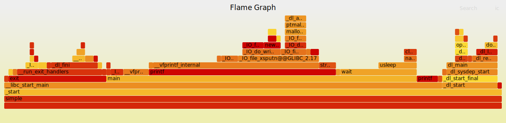

# install perf

## install on linux

See [How to Perform Perf Profiling in WSL2](https://www.scicoding.com/how-to-perform-perf-profiling-in-wsl2/)

```bash
sudo apt install linux-tools-generic
ls /usr/lib/linux-tools/5.4.0-216-generic/perf
```

5.4.0-216-generic is kernel version of linux, maybe different in the future.

add alias in .bashrc file if needed.
```bash
alias perf=/usr/lib/linux-tools/5.4.0-216-generic/perf
```

now you can use perf in your linux.

## use perf stat and record

See [用Perf寻找程序中的性能热点](https://zhuanlan.zhihu.com/p/134721612)

solve `Cannot load tips.txt file, please install perf!` when use `perf report -g`. Please try search in Bing.

```bash
sudo mkdir -p /usr/share/doc/perf-tip
wget https://raw.githubusercontent.com/torvalds/linux/master/tools/perf/Documentation/tips.txt
sudo mv tips.txt /usr/share/doc/perf-tip/
```

## FlameGraph

Download scripts for flame graph: [download link](https://github.com/brendangregg/FlameGraph)

Also see [How to Perform Perf Profiling in WSL2](https://www.scicoding.com/how-to-perform-perf-profiling-in-wsl2/)
, write a simple.c program.

```c
#include <stdio.h>
#include <unistd.h>
void wait(int ms) {
    usleep(ms * 1000);
}
int main() {
    for (int i = 0; i < 5; i++) {
        printf("Step %d\n", i);
        fflush(stdout);
        wait(100);
    }
    return 0;
}
```

```bash
# compile simple.c
gcc -O0 -ggdb3 -fno-omit-frame-pointer -o simple simple.c

# sample by perf
perf record -c 1000 -g ./simple
#perf record -e cpu-clock --call-graph dwarf -g -F 99 -p $PID

# generate flame graph
perf script > perf.script
./FlameGraph/stackcollapse-perf.pl perf.script > perf.folded
./FlameGraph/flamegraph.pl perf.folded > perf.svg
```

then you can use web browser open perf.svg

