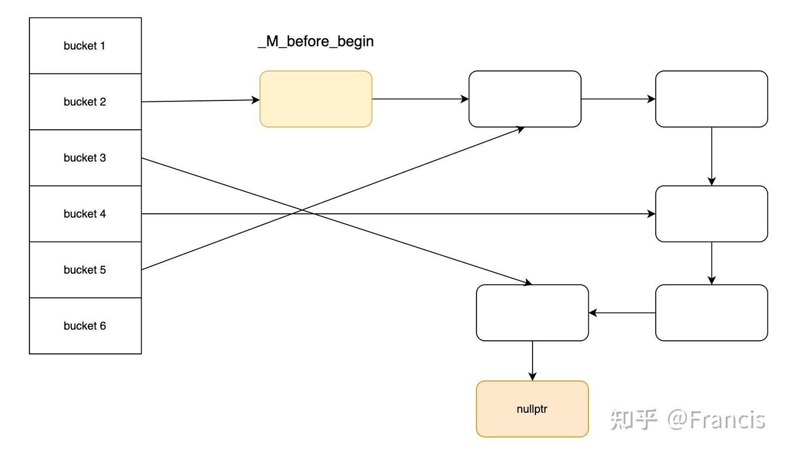

# GDB调试打印STL数据

从各种回答中，可查到的有两种方式：
- 较早的回答推荐使用stl-view-1.03.gdb文件；
- 较新的回答推荐使用python脚本pretty print。

其实都源自GDB Wiki网站中的[STLSupport页面](https://sourceware.org/gdb/wiki/STLSupport)，简单总结如下：

## GCC Python Scripts: Pretty Printer

要求GDB 7.0以上，直接在gcc的安装目录下查找：

```bash
which gcc
# 以gcc-9.4.0为例，用which gcc命令的结果补全路径
cd /home/.../gcc-9.4.0
find . -name "*libstdcxx*"
```

假设返回的结果为：`./share/gcc-9.4.0/python/libstdcxx`，就可以获得`libstdcxx`所在目录的绝对路径。

如果找不到文件，按照Wiki中建议下载gcc对应版本的文件到本地。

!> 建议将gcc-9.4.0/python这个文件夹，复制到其他路径下，方便当Python版本过低时，修改代码进行兼容。 

增加下面的脚本到`~/.gdbinit`中：（新增一个后缀为`.gdb`的脚本，在gdb启动后手动source也可以）

```bash
set print pretty on
set print object on
set print static-members on
set print vtbl on
set print demangle on
set print sevenbit-strings off

python
import sys
sys.path.insert(0, '/home/xxx/scripts/gcc-9.4.0/python')
from libstdcxx.v6.printers import register_libstdcxx_printers
register_libstdcxx_printers (None)
end
```

你要问我前面一堆set参数是啥意思，我只能说不知道，但可以根据名字推测；
参考文章4里这部分参数还写错了，实在不太行。

~~据说~~这样在gdb中直接`print`就能打印优化后的STL数据结果，原本的结果可以用`p /r`显示。

为啥是据说呢？因为在服务器上配置后，直接`print`会报错：

```bash
Python Exception <type 'exceptions.ValueError'> zero length field name in format
```

~~看了下脚本应该是支持Python3的；想直接用其他路径的Python3，配置半天没成功，遂放弃。~~

需要确认GDB在编译时链接的Python解释器版本（所以想改Python解释器是不行的，要和编译GDB时的版本对应）：

```bash
gdb --batch -ex 'python import sys; print(sys.version)'
```

大概率是`2.6.x`，版本问题导致的。原因也很简单，脚本中有Python2不支持的语法。只需要按照这个规则改一下：

```python
# 错误写法（Python 3 语法）
msg = "{}: {}".format(name, value)

# 正确写法（Python 2.6+ 兼容）
msg = "{0}: {1}".format(name, value)
```

直接在python文件夹里抓关键字：`grep "format" -nwr .`，结果如下：

```zsh
➜  <font color=cpan>python</font> grep "format" -nwr .
./libstdcxx/v6/printers.py:109:    t = '{}<{}>'.format(templ, ', '.join([str(a) for a in args]))
./libstdcxx/v6/printers.py:1146:            rx = r"""({0}::_Manager_\w+<.*>)::_S_manage\((enum )?{0}::_Op, (const {0}|{0} const) ?\*, (union )?{0}::_Arg ?\*\)""".format(typename)
./libstdcxx/v6/printers.py:1587:                    defarg = defarg.format(*template_args)
```

果然就是第一处format格式问题，改成：`t = '{0}<{1}>'.format(templ, ', '.join([str(a) for a in args]))`即可。

修改后的显示效果：

```bash
(gdb) p int_double_map
$2 = std::map with 6 elements = {
  [0] = 0,
  [1] = 0.29999999999999999,
  [2] = 0.59999999999999998,
  [3] = 0.89999999999999991,
  [4] = 1.2,
  [5] = 1.5
}
(gdb) p int_double_umap
$3 = std::unordered_map with 6 elements = {
  [5] = 1.5,
  [1] = 0.29999999999999999,
  [0] = 0,
  [2] = 0.59999999999999998,
  [3] = 0.89999999999999991,
  [4] = 1.2
}
```

## 【不建议】GDB script: gdb-stl-views

!> 即使新增了对于stl map/set的支持，还是有可能在namespace比较复杂的时候，出现gdb脚本语法错误。
查了半天还是没修复，deepseek都开始说胡话了。
因此，并不推荐使用这个方案。

这个是比较老的方法，我记得刚工作的时候就在用，至于这个脚本至少有十多年的历史。

在STLSupport页面上有下载地址。[`dbinit_stl_views-1.03.txt`](https://www.yolinux.com/TUTORIALS/src/dbinit_stl_views-1.03.txt)

同样是直接加到`~/.gdbinit`中，或者新增脚本等用的时候再source。

然而因为脚本太老，下载路径的时间戳是`2008-09-15`，对于现在gcc的stl实现可能有部分已经不适用。

已知的有：（其他问题随用随处理吧）
- `pstring`打印失败，虽然对于`std::string`的变量可以直接`p var.c_str()`显示`const char *`的结果；
- 不支持`unordered_set`和`unordered_map`。

### 支持`unordered_set`和`unordered_map`

让deepseek读入这个脚本，然后生成`punordered_set`和`punordered_map`的实现。

结果还不错，生成后能运行不报错，但有重复打印元素的问题。查了下相关的底层实现，进行了修正如下：

```
#
# std::unordered_set
#

define punordered_set
    if $argc == 0
        help punordered_set
    else
        set $table = $arg0._M_h
        set $num_buckets = $table._M_bucket_count
        set $num_elements = $table._M_element_count
        
        printf "Unordered set size = %u\n", $num_elements
        printf "Bucket count = %u\n", $num_buckets
        
        if $argc >= 2
            set $total_printed = 0
            set $before_begin = $table._M_before_begin

            set $node = $before_begin._M_nxt
            while $node != 0
                set $value = (void*)($node + 1)
                printf "elem[%u]: ", $total_printed
                p *($arg1*)$value
                set $node = $node._M_nxt
                set $total_printed++
            end
        else
            printf "Use punordered_set <set_var> <element_type> to print elements\n"
        end
        
        printf "\nLoad factor = %.2f\n", (double)$num_elements / $num_buckets
    end
end

document punordered_set
    Prints std::unordered_set<T> information.
    Syntax: punordered_set <set> <T>
    Example:
    punordered_set us - prints size and bucket count
    punordered_set us int - prints all elements, size, and bucket info
end
```
```
#
# std::unordered_map
#

define punordered_map
    if $argc == 0
        help punordered_map
    else
        set $table = $arg0._M_h
        set $num_buckets = $table._M_bucket_count
        set $num_elements = $table._M_element_count
        
        printf "Unordered map size = %u\n", $num_elements
        printf "Bucket count = %u\n", $num_buckets
        
        if $argc >= 3
            set $total_printed = 0
            set $before_begin = $table._M_before_begin

            set $node = $before_begin._M_nxt
            while $node != 0
                set $pair = (std::pair< $arg1, $arg2 > *)($node + 1)
                printf "elem[%u].key: ", $total_printed
                p $pair->first
                printf "elem[%u].value: ", $total_printed
                p $pair->second
                set $node = $node._M_nxt
                set $total_printed++
            end
        else
            printf "Use punordered_map <map_var> <key_type> <value_type> to print elements\n"
        end
        
        printf "\nLoad factor = %.2f\n", (double)$num_elements / $num_buckets
    end
end

document punordered_map
    Prints std::unordered_map<K,V> information.
    Syntax: punordered_map <map> <K> <V>
    Example:
    punordered_map um - prints size and bucket count
    punordered_map um int string - prints all key-value pairs
end
```

使用方法与`pset`和`pmap`相同，需要在指定变量后手动补充key和value的类型。

**注意：类型名中间不能有空格**，例如：

```
punordered_map var_map Pointer*const std::vector<int,int>
```

空格起到分隔参数的作用。（2026-04-10更新：然并卵）

### STL HashTable的结构

这部分用于记录deepseek生成代码的问题原因。

借用参考文章3中的一张图：


原本的逻辑：遍历每个bucket，然后访问每个bucket的链表中的元素。

然而buckets中的链表不是相互独立的，如图中所示，bucket 5的链表最后一个元素，其next指针并不是空；
而是指向bucket 4链表中的第一个元素。

**注意：图里bucket 2并没有数据，有数据的bucket 3 4 5**

并且这个实现顺序并不是固定的，即并不是bucket 1最后一个指向bucket 2第一个，这样依次连接。
按照deepseek的实现必然重复访问，除非能判断当前元素不属于当前bucket，STL代码里是这样做的，但在gdb脚本中很难实现。

正确的做法是使用`before_begin`这个指针，作用是哨兵节点，也是用迭代器遍历的起点。

## 参考文章：
1. [打印STL容器中的内容](https://wizardforcel.gitbooks.io/100-gdb-tips/content/print-STL-container.html)
2. [GCC中unordered set/map的实现原理（Part2图解哈希表结构）](https://zhuanlan.zhihu.com/p/259857549)
3. [C++那些事之彻底搞懂STL HashTable](https://zhuanlan.zhihu.com/p/644205339)
4. [gdb配置打印STL容器脚本pretty printer](https://www.codeleading.com/article/48416089480/)
